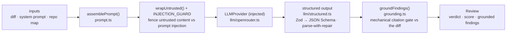

# `@devdigest/reviewer-core` — the review engine

Pure review logic: **diff → prompt → LLM → grounded findings**. No database,
GitHub, or filesystem; the only side effect is an LLM call through an **injected**
`LLMProvider`, which is what makes it mock-testable.

In the starter the **server** (`@devdigest/api`) is its only consumer — for local
reviews in the studio. (The CI runner that runs the same engine in GitHub Actions
is added back in the Export-to-CI lesson, L06.) The server wires it via a tsconfig
path alias (`@devdigest/reviewer-core` → `../reviewer-core/src`) and consumes the
TypeScript **source** directly (tsx in dev, vitest in tests). The package never
emits JS — its `build` is a type-check.

## Pipeline



The grounding step is the mandatory gate: a finding that doesn't cite a real line
in the diff is dropped, so the engine can't hallucinate locations. The score is
recomputed deterministically from the **surviving** findings, not trusted from the
model. `review/run.ts` orchestrates the run (single-pass by default).

The engine also accepts optional prompt slots the **course lessons** start
feeding it — `skills` (L02), `memory` (L07), `specs` (L05), `callers` — plus a
`reduce()`/map-reduce path and a `toReview()` CI payload helper used from L06.
In the starter the server passes only the diff, system prompt, and repo map; the
extra slots are omitted, so `assemblePrompt` simply leaves those sections out.

## Prompt layout

`assemblePrompt()` emits two messages (ADR 0012, ADR 0013, SPEC-02 D5). `N` is a
nonce generated per call:

```
system:  <agent system prompt>

         <one-line preamble>          ← only when skills are effective
         <skills-N>
         ### <name>
         <body>

         ### <name2> …
         </skills-N>

         injection guard (names N)    ← always LAST
user:    task · ## PR description · ## Relevant memory · ## Repo skeleton ·
         ## Project context · ## Callers of changed symbols · ## Diff to review
```

- Skills are **trusted instructions** (the server only passes vetted ones), so
  they live in the system message, not in an untrusted block. The guard closes
  the system message and states that skills may add checks but never waive
  findings, lower severity, or turn untrusted content into instructions.
- Every delimiter carries the per-call nonce: `<untrusted-N source="…">`,
  `<skills-N>`. The guard says a tag without exactly that suffix is data, so a
  skill or a PR cannot close a fence or forge a skills block without guessing
  N, whatever script it spells the tag in (ADR 0013). Pass `parts.nonce` in
  tests for stable output.
- `neutralizeDelimiters` is defense in depth on top: it runs on the assembled
  skills block and every untrusted block, and rewrites look-alike tags (any
  case, inner whitespace or zero-width characters, fullwidth `＜`/`＞`/`／` or
  letters) to a visible token such as `[/skills]`. A tag name followed by more
  identifier characters (`<SkillsTab>`) is left alone, so JSX diffs stay
  intact. It is not the boundary: no regex enumerates every homoglyph.
- `assembly.skills` is the rendered block as sent (preamble included);
  `assembly.skills_tokens = estimateTokens(block)`. Both are `null` with no
  skills, and the prompt is then identical to one built without the slot.
  `skills_used` is filled by the server, not here.
- The no-waiver rule is pinned at prompt level only (`test/prompt-skills.test.ts`).
  Whether a model actually obeys it is a behavioural eval, out of scope here.

## Public API

Exported from `src/index.ts`: `assemblePrompt` / `wrapUntrusted` (prompt),
`groundFindings` / `groundingSummary` (grounding), `toJsonSchema` / `extractJson`
/ `parseWithRepair` (structured output), plus the `run` entrypoint and
`reduce`, and the pure Smart Diff classifier (`classifyFile`, `ROLE_ORDER`,
`CLASSIFY_ORDER`, `ROLE_PATTERNS`). Contracts (`Review`, `Finding`, `Verdict`, …) come from
`@devdigest/shared`.

## Testing

`npm test` (vitest) — hermetic units with a stubbed `LLMProvider`: prompt
assembly, the grounding gate, `toReview` selection, and a full `run`. No keys,
no network. `npm run typecheck` doubles as the build. See
[`../TESTING.md`](../TESTING.md).
