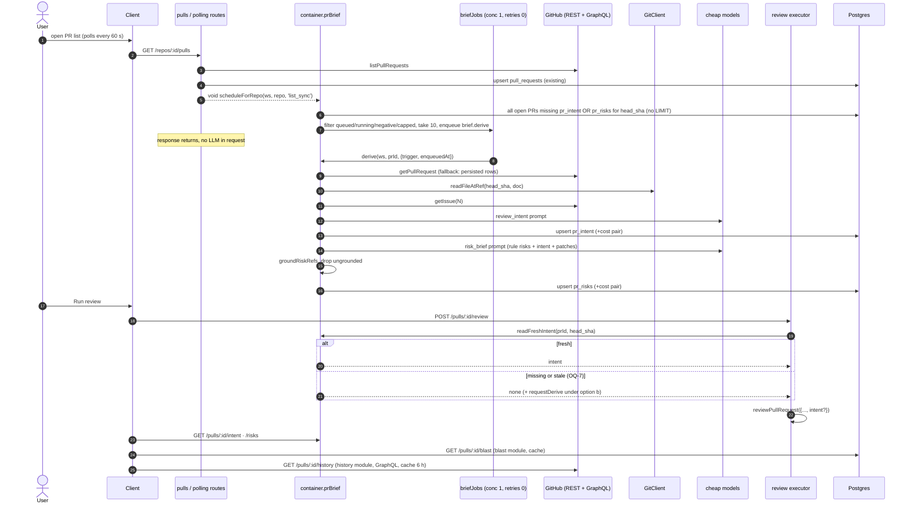

# Spec: PR Overview tab (Brief · Intent · Risk areas · Blast radius · Prior PRs)

**Status:** READY (v3; human decisions OQ-1..OQ-10 applied; round-5 findings applied and verified by main) · **Branch:** `feat/agent-system` (implementer may cut `feat/pr-overview`) · **Approach:** delegation-fixed, no brainstorm:
- **Brief:** composed client-side from the latest done agent run.
- **Intent + Risk areas:** derived by a new `brief` module on cheap feature models, as a background job **at PR import** plus an on-demand button. Intent feeds the review prompt as a new untrusted slot, read-only in pre-work.
- **Blast radius:** research Option A, reusing `RepoIntel.getBlastRadius` (deterministic, cached).
- **Prior PRs:** a GitHub GraphQL path-history query, cached, with deterministic notes.

Inputs (scratchpad, not committed): `pr-overview-design.md` (artboard `pr-overview`), `investigation-current-flow.md`, `research-intent.md`, `research-blast.md`, plus a researcher report on the GitHub API (2026-09-30, cited inline). Every claim relied on here was re-checked against the code. Two input claims were wrong and are corrected under **Data sources**.

**Size.** 14 steps, two over the planner's 12-step guideline, because the human put Risk areas, Prior PRs, the head persistence and the Settings toggle in scope (OQ-4, OQ-9, OQ-10). Delivery is four PRs, each green on its own:
- **A0** (step 0): the detail refresh persists `head_sha` (OQ-10). It is a tiny separate PR because it changes existing pulls-module behaviour (status derivation, review target) independently of the brief feature. It is easy to revert on its own, and PR A's freshness key relies on it.
- **A** (steps 1-8): contracts, schema, adapters, reviewer-core, `brief` module, import triggers, review read.
- **B** (steps 9-10): blast, history.
- **C** (steps 11-13): client, e2e.

## Problem & Motivation

Today the Overview tab renders only the raw description (`client/src/app/repos/[repoId]/pulls/[number]/_components/OverviewTab/OverviewTab.tsx:12-20`), and renders nothing at all when there is no body. A reviewer landing on a PR cannot see, in one place:
- what the latest agent run concluded;
- what the PR is *for*. The reviewer model never gets that either: `run-executor.ts:264` passes only `pull.body`, even though its docblock (`run-executor.ts:56,69`) claims "Loads diff + intent once";
- which risk classes it touches (dependencies, migrations, security, API breakage, performance);
- what else it can break (`RepoIntel.getBlastRadius`, `server/src/modules/repo-intel/service.ts:220-391`, has no caller);
- which earlier PRs changed the same files.

The scaffolding already exists:
- `pr_intent` / `pr_brief` tables (`server/src/db/schema/reviews.ts:83-97`);
- `Intent` / `BlastRadius` / `Risks` / `PrHistory` / `PrBrief` contracts (`server/src/vendor/shared/contracts/brief.ts:9-121`);
- the `review_intent` and `risk_brief` feature models (`contracts/platform.ts:53-66`);
- the `brief` and `blast` i18n namespaces.

This spec wires them.

## Goals / Non-goals

### Goals

1. An Overview tab that follows the design. A **PR Brief** section holds a VerdictBanner from the latest agent run. Below it sits a two-card grid. The left card has **Intent**, then **Risk areas** (a RiskPillRow). The right card has **Blast radius** (tree and graph views), then **Prior PRs touching these files** (a HistoryAccordion). The Description block stays below the grid.
2. **Intent.** Derived from title, description, linked issue, linked plan/spec docs, and indirect signals (branch, commits, paths, diffstat), using a **separate cheap model chosen in Settings**. Confidence is **capped deterministically in code**. Same-repo docs are read **at head SHA with containment**. External links are recorded as unresolved and never fetched.
3. **Intent reaches the review.** A new `intent` slot in `PromptParts`, fenced by `wrapUntrusted` and the per-assembly nonce (ADR 0013), size-capped, and covered by the existing injection guard. Pre-work only **reads** a fresh intent.
4. **Risk areas.** Kinds are `security | db_migration | breaking_api | perf | deps`. A deterministic pre-pass (deps, db_migration) is backed by an LLM on the `risk_brief` feature model. Every `file_ref` is **grounded deterministically** against the PR's changed files and lines, and ungrounded refs are dropped.
5. **Blast radius.** Deterministic from the repo-intel index. The per-symbol caller cap is fixed. Results are cached, and a degraded result gets its own UI state.
6. **Prior PRs.** Merged PRs that touched the changed files, from GitHub path history. This works on a shallow clone. Results are cached with a TTL. Notes are deterministic.
7. Every LLM call records tokens and cost **with provenance** (ADR 0002) and is observable in pino. Import-time work never makes an LLM call inside a request.

### Non-goals

- `pr_brief` table wiring. It stays unwired, because each block has its own endpoint and freshness key (D12).
- Passing risks or history into the review prompt.
- LLM-written per-PR history `notes` (OQ-8).
- Fetching Jira, Linear, Notion, Confluence, or arbitrary URLs (D6).
- Intent or risks on the CI / GitHub-Action path. The slot is optional there.
- The design's `ComposeReviewDrawer` and the Files tab.
- `platform/model-router.ts` and `platform/prompts.ts` (AGENTS.md: unwired scaffolding).

### Decisions

**D1 — When intent and risks run: import-time job plus a button (human decision OQ-1, replaces v1's pre-work derivation).**

Evidence for the import paths:

| Path | Evidence | Frequency | Has body/files/commits? |
|---|---|---|---|
| List sync `GET /repos/:id/pulls` | upsert loop `server/src/modules/pulls/routes.ts:48-83`; up to 50 PRs, `state:'all'` (`adapters/github/octokit.ts:42-49`) | **every 60 s** while the list is open, plus on focus (`client/src/lib/hooks/core.ts:122-130`) | no (`listPullRequests` maps no body/files, `octokit.ts:50-63`) |
| Manual poll `POST /repos/:id/poll` | `server/src/modules/polling/routes.ts:20-62` | on click | no |
| Detail refresh `GET /pulls/:id` | `pulls/routes.ts:252-292` persists files, commits, body | on PR page open | yes |

Decision:
- **All three paths trigger scheduling**, and only after their GitHub call succeeded, inside the existing `try`. With no token nothing is scheduled, so offline or seeded rows are never auto-derived.
- The route makes one fire-and-forget call: `void container.prBrief.scheduleForRepo(ws, repoId, trigger)` for list and poll, or `scheduleForPull(ws, prId, 'detail')` for detail. It passes no data and has no branching. The facade decides.
- **What gets scheduled:** PRs with `status = 'open'` and **no `pr_intent` row or no `pr_risks` row for the current `head_sha`**. That covers new PRs and moved heads. A PR is skipped if it is already queued or running (in-memory state, AC-10), or if it has a negative-cache entry for `(prId, head_sha, phase)`.
- The facade also skips the whole scheduling pass when the `review_intent` provider is not configured. It checks this once, without calling any model, and logs at `debug`. Without that check, a missing key would enqueue 50 jobs every minute.
- **Bounded:**
  - `AUTO_BRIEF_MAX_PER_SYNC = 10` PRs per scheduling call, ordered by `updated_at DESC NULLS LAST`. The repository query has **no LIMIT**. Candidate = open PR with **no `pr_intent` row OR no `pr_risks` row** for the current head, so a restart between the two upserts still reschedules. It returns every open candidate for the repo, at most the ≈50 synced rows. The **service** first drops queued, running, negative-cached and attempt-capped PRs, then takes 10 and increments `queued` through the same code path as `requestDerive`. Putting the SQL limit before those skips would stall the queue on the top 10.
  - A dedicated `container.briefJobs = new JobRunner(db, { concurrency: 1, retries: 0, timeoutMs: 150_000 })`. The precedent is `evalJobs` (`platform/container.ts:69-75,103`). Brief work never starves clone and index jobs on `container.jobs` (concurrency 3, `platform/jobs.ts:35`), and `retries: 0` means a failure never pays twice.
- **First import of 50 PRs:** 10 PRs per 60 s poll, one job at a time. At about 5-15 s per job, 50 open PRs drain in about 5 minutes. PRs the user opens earlier jump the queue through the detail trigger.
- **Cost math** (openrouter / `deepseek/deepseek-v4-flash`, $0.14 per M input and $0.28 per M output tokens, `server/src/adapters/llm/pricing.ts:40`):

  | Call | Worst case | Cost |
  |---|---|---|
  | Intent | 24 000 input chars (about 6.5k tokens incl. system) + 800 output tokens | ≈ $0.0011 |
  | Risks | 30 000 chars of patches (about 8.5k tokens) + 1 200 output tokens | ≈ $0.0015 |
  | **Per PR** | both calls | **≤ $0.0026** (typical about $0.0008) |
  | **One successful pass, 50-PR first import** | 50 × per PR | **≈ $0.14** |
  | **Failure worst case, 50-PR import** | 3 automatic attempts × (`maxRetries` 1 + 1) calls per phase × 50 | **≈ $0.80**, bounded by the attempt cap |

  After that, cost is one pair per head push.
- **GitHub cost per job:** `getPullRequest` makes 3 REST requests (`octokit.ts:74-90`), plus at most 1 `getIssue`. A 50-PR import is about 200 of the 5 000 per hour authenticated limit (researcher: https://docs.github.com/en/rest/using-the-rest-api/rate-limits-for-the-rest-api).
- **No LLM or GitHub-detail call ever happens inside a request.** The job handler fetches the PR detail itself, in memory only, so the module never writes pulls-owned tables.
  - **Freshness key:** `pr_intent.head_sha` and `pr_risks.head_sha` are always the **persisted** `pull_requests.head_sha` read at job start. List sync and poll move it (`pulls/routes.ts:74`, `polling/routes.ts:53`), and so does the detail refresh since PR A0 (site 23a).
  - The in-memory GitHub detail is used only when `detail.head_sha === pull.headSha`.
  - If the heads differ (`head_moved`), the job stores **nothing** and exits with `{ok:false, reason:'head_moved'}`. `head_moved` does **not** count toward the attempt cap; its UI copy reads "PR changed on GitHub; refresh the page". Persisted `pr_files` may belong to an older head, and the next list sync or detail refresh moves `head_sha` and reschedules.
  - If the fetch fails or there is no token, the job stores nothing either, **except** for `on_demand`. There it falls back to the persisted `body` / `pr_files` / `pr_commits` (the seeded/offline case) and records `sources[].ref = 'persisted'`.
  - The job **ignores `detail.linked_issue`**, because `resolveLinkedIssue` resolves a bare `#N` (`octokit.ts:127-135`), which D6 forbids. Issues are resolved only through D6's own extraction.
- **Opt-out:** `AUTO_BRIEF` env (config `autoBriefEnabled`). It defaults to `NODE_ENV !== 'test'`, the same precedent as the rate limit (`server/src/app.ts:116`) and silent logs (`platform/config.ts:83`). `scripts/e2e.sh` exports `AUTO_BRIEF=false`, because the e2e API reads the developer's real `~/.devdigest/secrets.json` (`config.ts:80`; `scripts/e2e.sh:41-44` exports no key override).
- **Per-workspace toggle (human, OQ-9):** `settings.automatic_brief: boolean`, default `true`. **The effective value is `value !== false`**: a missing row means ON. `SettingsKnown` defaults never apply at runtime, because `rowsToSettings` returns the raw bag (`settings/helpers.ts:10-14`) and `GET /settings` returns it unparsed (`settings/routes.ts:34`).
  - **Single owner of the default:** a new uncached `container.automaticBrief(ws): Promise<boolean>`, next to `featureModel` (`container.ts:138-140`). It is backed by a helper in `modules/settings/feature-models.ts`, the same file and read pattern as `getFeatureModelOverride` (`:36-47`), and returns `raw !== false` (the default constant is exported from that helper). The `settings.autoBrief(ws)` port in `brief/wiring.ts` adapts it, so brief never reads `t.settings` and never imports `modules/settings`.
  - The client uses a pure `isAutoBriefOn(settings)` (`!== false`) in `SettingsModels/helpers.ts`, with a unit test.
  - The toggle sits next to `automatic_reviews` (`platform.ts:94`). The effective switch is `autoBriefEnabled (env) && workspace.automatic_brief`.
  - The env is the **hard kill-switch**: it is process-wide and read at boot, and it is what tests and e2e need, because it must hold even before any settings row exists.
  - The toggle is the per-workspace default, ON: a user-facing preference, read per gate call like feature models (`settings/feature-models.ts:36-47`, one select per call), so it applies without a restart.
  - The env cannot be overridden from the UI, so a test or e2e run can never be re-enabled by a stale settings row.
  - The toggle affects only automatic triggers. `on_demand` ignores both.

| Combination option | + | − |
|---|---|---|
| **env AND toggle (env = kill-switch)** | tests/e2e safe regardless of DB; users control per workspace | two knobs to explain |
| toggle only | one knob | tests/e2e depend on DB state; a seeded `true` would bill |
| env only | simplest | no user control (OQ-9 asks for it) |

| Option (for the record; the human chose row 2) | + | − |
|---|---|---|
| Review pre-work (v1 D1) | pays only for reviewed PRs | first review waits; Overview empty until a review ran |
| **Import (list/poll/detail) + button** | Overview populated before anyone reviews | pays for PRs nobody reviews (bounded above); needs scheduling, caps and dedupe |
| Button only | zero automatic cost | Overview empty by default |

**D1a — Review pre-work reads, never derives.** After loading the diff, pre-work calls `container.prBrief.readFreshIntent(prId, pull.headSha)`. This makes no LLM or network call. A row for the current head gives an intent. Anything else gives no intent, the review prompt stays byte-identical to today's, and the Live Log gets one `info` line. A stale intent (the head moved after import) is a real gap, so how it is handled was **OQ-7, now resolved: option (b)**:

| Option on missing/stale intent at review time | + | − |
|---|---|---|
| (a) Review without intent; do nothing else | simplest; zero added latency | a PR reviewed right after a push never gets intent in that review |
| **(b) Review without intent + fire-and-forget `requestDerive`** (recommended) | zero added latency; next review and Overview have it | first review after a push still lacks intent |
| (c) Pass the **stale** intent, labelled `(stale: derived for <sha7>)` | some context is better than none for small pushes | scope may be wrong after a force-push or rebase; the model may over-trust it |
| (d) Await derivation in pre-work (v1 behaviour, ≤ 45 s budget) | review always has current intent | contradicts the human's OQ-1 decision; adds latency to every review after a push |

Step 8 and AC-13/14 are written for (b). They need a one-line change for (a) or (c). Option (d) would re-add the v1 pre-work code path.

**D2 — A failed intent or risk derivation never aborts anything** (human, OQ-2). A review runs without intent. The Overview shows an error state for that block only.

**User requirement (verbatim, relayed 2026-09-30):** "в settings можна було обирати модель для інтент модуля, по дефолту нехай буде дешева flash4 від deep seek". In English: the intent model is selectable in Settings, and by default it is DeepSeek's cheap flash model.

**D3a — Settings → Models already offers the choice. Verified against the code; no UI change is needed:**
- `SettingsModels.tsx:38-66` renders one picker per `FEATURE_MODELS` entry from the client copy (`client/src/lib/feature-models.ts`). That covers `review_intent` ("PR Review · Intent") and `risk_brief` ("Risk Brief").
- The picker is a `SearchableSelect` over the **live OpenRouter model list**. It is a list, not free text: `useProviderModels("openrouter")` (`SettingsModels.tsx:23`, hook at `client/src/lib/hooks/agents.ts:92`). The current value is always selectable even when it is not in the list (`:41-45`).
- A choice is saved as `feature_models[id] = { provider: 'openrouter', model }` via `PUT /settings` (`:29-32`). There is **no provider picker**, so a user chooses among OpenRouter models, which also proxy OpenAI and Anthropic ones. This matches the new cheap defaults.
- Without an OpenRouter key, the list is empty and the note `models.noKeyNote` asks the user to add a key (`:27,70`; `client/messages/en/settings.json:34`). The picker is **not blocked**: the current or default value stays shown and selectable.
- Server side: `resolveFeatureModel` reads `settings.feature_models` **on every call** (`server/src/modules/settings/feature-models.ts:36-57`, a fresh DB select each time). `container.featureModel` does not memoize (`platform/container.ts:138-140`), so a new choice applies to the next derivation without a restart.
- `BriefService` must **not** cache the resolved choice. It calls `featureModel` once per phase per job.
- `container.llm(provider)` caches only the *client per provider id* (`container.ts:212-220`), not the model, so a model switch is honoured.
- What is missing: no RTL test covers `SettingsModels`, and `server/test/settings-models.it.test.ts:31` tests only `onboarding`. Tests are added (steps 1 and 6).

**D3 — Cheap defaults.** Both `review_intent` (currently `openai/gpt-4.1`, `platform.ts:53-59`) and `risk_brief` (currently `openai/gpt-4.1`, `platform.ts:60-66`, not cheap: $2 / $8 per M, `pricing.ts:18`) become `openrouter` / `deepseek/deepseek-v4-flash`. The change goes into all **three** registries: both vendored `platform.ts` files and `client/src/lib/feature-models.ts:21-34` (client INSIGHTS: "FEATURE_MODELS has a third, client-local runtime copy"). Saved workspace overrides are untouched (`settings/feature-models.ts:36-57`).

| Option | $/M in·out | + | − |
|---|---|---|---|
| **openrouter / deepseek-v4-flash** | 0.14 · 0.28 (`server/src/adapters/llm/pricing.ts:40`, priced, so the cost badge is never `no_price`; OpenRouter also reports the real charge) | same default as `onboarding`/`conventions` (`platform.ts:46-52,74-80`); provider-reported cost (`cost_source: provider`) | needs `OPENROUTER_API_KEY`, and scheduling is skipped without it (D1) |
| openai / gpt-4o-mini | 0.15 · 0.60 (`pricing.ts:21`) | works with an OpenAI key only | estimated cost only |
| keep gpt-4.1 | 2.0 · 8.0 | none | about 14× the input price |

**D4 — Where the logic lives.**
- **`server/src/modules/brief/`** is a full onion module that owns intent and risks, modelled on `modules/conventions/`.
- **`modules/blast/`** and **`modules/history/`** are separate modules. They have different data sources and no LLM.
- The review executor and the pulls/polling routes reach `brief` through a container facade, **`container.prBrief`** (the `container.repoIntel` seam, `platform/container.ts:35-36,163-167`). Modules never import each other (`.dependency-cruiser.cjs:37-46`; server INSIGHTS: "even a type-only import between modules fails arch:check").

| Option | + | − |
|---|---|---|
| **`brief` module (intent + risks) + `container.prBrief` facade; separate `blast` and `history`** | risks depend on intent output (one job, one prompt chain); one memoized instance keeps queued/in-flight state coherent across routes, jobs and the executor | the container imports `modules/brief/wiring.ts` (precedent `container.ts:36`) |
| Separate `intent` and `risks` modules | smaller modules | two facades; a cross-module dependency (risks need intent), which the rules forbid |
| Grow `modules/reviews` | fewer files | legacy-shaped module (`reviews/service.ts:34-38`); the onion skill forbids growing that debt |

**D5 — Brief composition: client-side.** A pure `selectLatestBrief(runs, reviews)` over `usePrRuns` / `usePrReviews`, which the page already runs (`PrDetailContent.tsx:43,48`). "Latest" means the newest `RunSummary` with `status === 'done'` **and** a `ReviewRecord` with the same `run_id` and `kind === 'review'`. If the newest run overall is running, failed or cancelled, a notice names it (human, OQ-3).

| Option | + | − |
|---|---|---|
| **Client composition** | zero server/contract change; same cache as the Agent runs tab | join logic lives in the client (unit-tested) |
| `GET /pulls/:id/brief` | one anchor | duplicates data the client already holds |

**D6 — Link resolution** (deterministic, `brief/domain.ts`; at most `MAX_LINKED_DOCS = 3` docs):

| Link | Action |
|---|---|
| Relative doc path (`.md .mdx .txt .rst .adoc`) | read at `head_sha` via `GitClient.readFileAtRef` |
| `https://github.com/<owner>/<repo>/blob/<ref>/<path>`, same repo (case-insensitive) | read `<path>` at **`head_sha`** (URL ref ignored, recorded in `sources[].ref`) |
| `closes/fixes/resolves #N` or same-repo `/issues/N` URL | `github.getIssue(repo, N)` (`adapters.ts:204`) |
| Bare `#N` | ignored (false-positive source, `octokit.ts:128`) |
| Any other host or repo | `unresolved_links` with a reason; **never fetched**. No allowlist: there is no SSRF-safe fetch helper, and the SaaS targets need tokens we don't hold |

| Option for same-repo docs | + | − |
|---|---|---|
| **Local git object DB (`git cat-file` at `head_sha`)** | offline; reads the tree, not the working copy, so a symlink cannot escape; correct revision | head may be missing from the shallow clone, so one force `fetchPullHead` retry, then `not_available`. The fetch shares a per-repo in-process mutex with `sync` (both mutate `.git/shallow`); a lock busy beyond the budget gives `not_available` |
| GitHub Contents API | independent of clone state | token + network per doc |
| `GitClient.readFile` (working tree) | exists | wrong revision; no containment (`simple-git.ts:129-131`) |

**D7 — Intent confidence cap** (`brief/domain.ts`). The stored value is `min(model, cap)` on `low < medium < high`.
- A resolved spec/plan doc, a resolved linked issue with a body, or a description with meaningful length ≥ `RICH_DESCRIPTION_CHARS = 200` → cap `high`.
- A meaningful length ≥ `MIN_DESCRIPTION_CHARS = 40` → cap `medium`.
- Otherwise the cap is `low`: only title, branch, commits, paths and diffstat are available.
- An unresolved link that looks like a spec (`/spec|plan|design|rfc|adr/i`) lowers the cap to at most `medium`.
- "Meaningful length" is the body with these removed: HTML comments (PR templates), markdown headings, checkbox lines, whitespace.

**D8 — Risk trigger.** Risks run in the **same `brief.derive` job, right after intent**. They are a separate LLM call on `risk_brief`, and the intent is passed to that call as an untrusted input.

| Option | + | − |
|---|---|---|
| **Same job as intent (import + button)** | one freshness key (`head_sha`); Overview complete before review; one GitHub detail fetch shared | risk cost paid for unreviewed PRs (≤ $0.0015 each, D1) |
| On review completion (from findings) | reuses the reviewer's analysis | empty until a review; couples Risk areas to agent choice; findings ≠ merge-risk classes |
| On demand only | cheapest | empty by default; contradicts the design's always-on block |

**D9 — Risk grounding and pre-pass** (deterministic, `brief/domain.ts`).

*Pre-pass rules.* Their output is always kept, with `origin: 'rule'`:
- **deps:** a changed basename in `package.json, pnpm-lock.yaml, package-lock.json, yarn.lock, go.mod, go.sum, Cargo.toml, Cargo.lock, pyproject.toml, poetry.lock, Gemfile, Gemfile.lock, requirements*.txt`. Severity `medium` when a manifest changed; `low` when only lockfiles changed. `file_refs` = those paths.
- **db_migration:** a changed path matching `/(^|\/)(migrations?|migrate)\//`, or `/\.sql$/`, or `/(^|\/)prisma\/migrations\//`. Severity `high` if an added patch line matches `/\b(DROP|TRUNCATE)\b|\bALTER\s+TABLE\b[^;]*\b(DROP|RENAME)\b/i`, otherwise `medium`.

*Model risks* (`origin: 'model'`):
- The prompt gets the rule risks as trusted context and may add any kind. Output is capped at 6 risks.
- A model risk with the same `kind` as a rule risk is merged into it. The rule severity is the floor, refs are unioned, and the model explanation is kept.

*Grounding* `groundRiskRefs(refs, changed)`:
- Accepted forms are `path`, `path:N` and `path:N-M`. A leading `./` is stripped.
- `path` must equal a changed file.
- A line or range must intersect a new-side hunk range of that file (parsed from the patches with `container.parseDiff`, the same parser as `reviews/diff-loader.ts:33-43`).
- For a file with no patch (binary or oversized), only the bare `path` form is accepted.
- Ungrounded refs are dropped and counted in `dropped_refs`. A model risk left with zero refs is dropped.

**D10 — Client imports of `@devdigest/shared` stay `import type`** (delegation). Client INSIGHTS (2026-09-29) says value imports now resolve (`next.config.mjs` `extensionAlias`), so opting into ADR 0007 response schemas is a cheap follow-up.

**D11 — Prior PRs data source.**

| Option | Data gap resolved? | Cost / rate | + | − |
|---|---|---|---|---|
| **GitHub GraphQL, one aliased query of `Commit.history(path:, first:N) { associatedPullRequests(first:1) { number title mergedAt author } }`, one alias per path, on the base branch** | yes: remote full history, independent of the shallow clone; `mergedAt` from the API | about 1 point per query for 10 paths × `first:10` (cost formula: https://docs.github.com/en/graphql/overview/rate-limits-and-node-limits-for-the-graphql-api; 5 000 points/h) | 1 request per Overview open (cached); `octokit` 4.1.4 exposes `.graphql` (researcher: `server/package.json:36`, `pnpm-lock.yaml:4295-4305`) | needs a token; `associatedPullRequests` may return open PRs, so filter `mergedAt != null` (schema docs); aliasing several `history` fields is standard GraphQL but **untested here**, so step 10 tests it and falls back to one query per path |
| REST `GET /commits?path=` + `GET /commits/{sha}/pulls` | yes | P + P×N requests (≈ 60-100 per PR) | simple REST | about 100× the requests; burst secondary limits |
| Store `merged_at` + backfill `pr_files` for merged PRs, then query locally | partly: only PRs inside the synced window (50 most-recently-updated) | 1 `listFiles` per merged PR | offline reads | misses older history; `PrMeta` contract change; backfill job |
| Deepen the clone and `git log -- path` | yes for commits; PR numbers only via commit-message heuristics | fetch depth cost; races `sync` | local | squash/merge message parsing is unreliable; conflicts with the indexer's fetch policy |
| Search API | no (no path qualifier; 30 req/min) | — | — | — |

Details:
- Query at most `HISTORY_MAX_PATHS = 10` changed files, highest churn first, with `HISTORY_PER_PATH = 10` commits each.
- Group results by PR number into `files_overlap`, exclude the PR itself, sort by `merged_at DESC`, keep `HISTORY_MAX_ITEMS = 10`.
- **Notes are deterministic:** `notes = ''`, and the UI renders the overlap list through the existing `brief.overlap` key. LLM relevance notes are OQ-8.
- No token → `unavailable/no_github`.

**D12 — Storage per block, not `pr_brief`.**

| Option | + | − |
|---|---|---|
| **One table per block** (`pr_intent` extended, `pr_risks`, `pr_blast_cache`, `pr_history_cache`) | independent freshness keys and error states; each has an obvious single writer | four tables |
| One `pr_brief.json` document | the table exists | blocks have different keys (head vs index sha vs TTL); a partial failure overwrites siblings; the composed `PrBrief` contract implies all-or-nothing |

**D13 — Blast cache.** New `pr_blast_cache`. The key is `head_sha, source_sha, indexer_version, index_status, repo_intel_enabled` (see Schema).

| Option | + | − |
|---|---|---|
| **Cache table** | a ripgrep fallback on unindexed repos (`repo-intel/service.ts:236-303`) runs once per key | one table |
| Compute per GET | simplest | slow fallback on every tab open |

**D14 — Blast is computed against the indexed revision**, the clone's default branch, not the PR head. Symbols that exist only in the PR have no callers. The UI shows "based on index at `<sha7>`".

**ADR needed: yes, two.** Both are drafted by doc-writer after approval. `docs/adr/0021-dev-agent-pipeline.md` already exists, so the next free numbers are `0022` and `0023`.
- **ADR 0022 — "Derived PR brief: import-time cheap-model jobs, deterministic confidence cap and risk-ref grounding, untrusted intent prompt slot."** Records D1, D1a, D2, D3, D6-D9. Risk areas fold into this ADR rather than getting a separate one, because they share the trigger, job, cost and grounding patterns with intent.
- **ADR 0023 — "Prior-PR history from GitHub GraphQL path history."** Records D11: the first GraphQL use in the codebase, a new external-API pattern with its own rate budget.

## Data sources

| Block | Source | Evidence | Notes |
|---|---|---|---|
| Brief verdict/summary/score/findings | `GET /pulls/:id/reviews` | `db/schema/reviews.ts:12-28`, `contracts/review-api.ts:23-37` | joined by `run_id` |
| Brief cost/tokens/blockers/status | `GET /pulls/:id/runs` | `contracts/trace.ts:116-140` | ADR 0002 pair |
| Intent/risks: title, body, branch, head, diffstat, files+patches, commits | job: `github.getPullRequest` in memory (`octokit.ts:70-124`); fallback `pull_requests` / `pr_files` / `pr_commits` via `container.reviewRepo` | `db/schema/pulls.ts:5-56`; `reviews/repository.ts:39-49` | **Correction:** research-intent says commits are never persisted. They are, on detail refresh (`pulls/routes.ts:268-279`). |
| Intent linked issue | `github.getIssue` | `adapters.ts:204` | `PrDetail.linked_issue` is not persisted |
| Intent linked docs | `GitClient.readFileAtRef` (new) | `adapters.ts:245-268` | D6 |
| Feature models | `container.featureModel(ws, id)` | `container.ts:138-140` | Settings → Models already lists both |
| Blast | `container.repoIntel.getBlastRadius` + `getIndexState` | `repo-intel/service.ts:189-205,220-391` | **Correction:** research-blast puts the cap at "~389"; it is at `service.ts:386`, after the global sort at `:372` |
| Prior PRs | `GitHubClient.listPathHistory` (new, GraphQL) | researcher report; `octokit.ts:1` imports `octokit` | cached 6 h |

## Call sequence



On-demand path:
1. `POST /pulls/:id/brief/derive` calls `container.prBrief.requestDerive(ws, prId, 'on_demand')`, which returns `undefined` when the PR is not in this workspace. The route maps that to 404.
2. The service increments `queued` for the PR, then calls `container.briefJobs.enqueue(workspaceId, 'brief.derive', { workspaceId, prId, trigger, enqueuedAt })`. The payload is the handler's only input (`jobs.ts:65-90`), so it carries the trigger (for the persisted-fallback rule, the attempt cap and logging) and the enqueue time (for the freshness skip). The signature is `enqueue(workspaceId, kind, payload)` (`platform/jobs.ts:65`). On rejection it decrements and rethrows (route → 500).
3. Per-PR state is `{ queued: number; running?: Promise }`:
   - `queued` is decremented exactly once per job: by the handler's `finally` when the handler ran (a `started` flag is set on handler **entry**), otherwise by the `done`-settle path;
   - only the owner of `running` clears it;
   - `inFlight = queued > 0 || running != null`.
4. The handler **never throws**, so no retry spend even if retries were on.
5. When a job starts and a `pr_intent` row for the current head has `derived_at` later than the job's enqueue time, the job skips the intent LLM call. The same rule applies to `pr_risks`.
6. On-demand requests bypass the negative cache.

## Schema changes

All changes go in `server/src/db/schema/reviews.ts`, exported via `server/src/db/schema.ts:32,67-68`.
- The migration is created **only** by `cd server && pnpm db:generate`. Never hand-edit it.
- `pnpm db:migrate` does not run on boot.
- There is no backfill. No rows exist in these tables, so ADR 0002's "never backfill cost" rule is not triggered.

**`pr_intent`** (extend `:83-90`):

| Column | Type | Null / default |
|---|---|---|
| `head_sha` | text | nullable |
| `confidence` | text enum `high, medium, low` | not null, default `'low'` |
| `sources` | jsonb `IntentSource[]` | not null, default `'[]'` |
| `unresolved_links` | jsonb `UnresolvedLink[]` | not null, default `'[]'` |
| `provider`, `model` | text | nullable |
| `tokens_in`, `tokens_out` | integer | nullable |
| `cost_usd` | double precision | nullable |
| `cost_source` | text enum `provider, estimated` | nullable |
| `derived_at` | timestamptz | not null, default `now()` |

`cost_usd` and `cost_source` are a pair: both null or neither. The brief repository's upsert is the single write path.

**`pr_risks`** (new):

| Column | Type | Null / default |
|---|---|---|
| `pr_id` | uuid PK → `pull_requests.id` | ON DELETE CASCADE |
| `head_sha` | text | not null |
| `risks` | jsonb `Risk[]` | not null |
| `dropped_refs` | integer | not null, default 0 |
| `rule_only` | boolean | not null, default false (true when the LLM call failed and only rule risks were stored) |
| `provider`, `model`, `tokens_in`, `tokens_out`, `cost_usd`, `cost_source` | as `pr_intent` | same pair rule |
| `derived_at` | timestamptz | not null, default `now()` |

**`pr_blast_cache`** (new):

| Column | Type | Null / default |
|---|---|---|
| `pr_id` | uuid PK | cascade |
| `head_sha` | text | not null |
| `source_sha` | text | not null. The index's `last_indexed_sha` when the index is `full`/`partial`; otherwise the clone's `git.currentHead`, or `''` with no clone. `last_indexed_sha` is always `''` when unindexed (`service.ts:199`). |
| `indexer_version` | integer | not null |
| `index_status` | text | not null |
| `repo_intel_enabled` | boolean | not null |
| `status` | text enum `ok, degraded` | not null |
| `reason` | text | null |
| `blast` | jsonb `BlastRadius` | not null |
| `truncated` | boolean | not null, default false |
| `computed_at` | timestamptz | not null, default `now()` |

**`pr_history_cache`** (new):

| Column | Type | Null / default |
|---|---|---|
| `pr_id` | uuid PK | cascade |
| `head_sha` | text | not null |
| `base` | text | not null |
| `paths_hash` | text | not null (sha256 of the sorted queried paths; `modules/_shared/hash.ts`) |
| `history` | jsonb `PrHistoryItem[]` | not null |
| `computed_at` | timestamptz | not null, default `now()` |

The history cache is fresh iff the key matches and `computed_at` is younger than `HISTORY_TTL_MS = 6 h`.

The caller-less legacy `reviews/repository/pull.repo.ts:49-70` `upsertIntent`/`getIntent` (and the wrappers at `reviews/repository.ts:165-171`) are **deleted**. `getPrCommits(prId)` is added.

## API

Contracts go in **both** `server/src/vendor/shared/` and `client/src/vendor/shared/`, byte-identical (ADR 0001; `diff -r` is empty today). Only type signatures are shown here.

- **`brief.ts`:**
  - `IntentConfidence = enum high|medium|low`
  - `IntentSourceKind = enum title|description|issue|spec|branch|commits|paths|diffstat`
  - `IntentSource = { kind, ref: string|null, chars: number }`
  - `UnresolvedLinkReason = enum external_host|other_repo|not_a_doc|not_found|not_available|too_large|unsafe_path|limit_reached|fetch_failed`
  - `UnresolvedLink = { url, reason }`
  - `RiskKind = enum security|db_migration|breaking_api|perf|deps`
  - `Risk.kind`: `z.string()` → `RiskKind`. Add `origin: enum rule|model` to `Risk`.
  - `BlastStatus = enum ok|degraded|unavailable`
  - `BlastReason = enum index_partial|no_index|flag_off|no_changed_files`
  - `PrBlastResponse = { status, reason|null, blast: BlastRadius|null, head_sha, source_sha|null, index_status, cached, truncated, computed_at|null }`
  - `HistoryStatus = enum ok|unavailable`
  - `HistoryReason = enum no_github|fetch_failed|no_changed_files`
  - `PrHistoryResponse = { status, reason|null, history: PrHistoryItem[], queried_paths: string[], cached, computed_at|null }`
  - `PrBrief` is unchanged and still unserved (D12).
- **`review-api.ts`:**
  - `PrIntentRecord` (`:60`, no consumers) becomes `Intent.extend({ pr_id, head_sha|null, confidence, sources, unresolved_links, provider: Provider|null, model|null, tokens_in|null, tokens_out|null, cost_usd|null, cost_source: CostSource|null, derived_at })`
  - `BriefFailureReason = z.enum(['provider_not_configured','timeout','llm_error','parse_error','no_pull','head_moved','internal'])`. This is the **single** source for the enum; `brief/types.ts` imports it as a type only (precedent `modules/agents/domain.ts:10`). It covers both phases.
  - `BriefFailure = { reason: BriefFailureReason; at: string }`
  - `PrIntentResponse = { intent: PrIntentRecord|null, stale, in_flight, last_failure: BriefFailure|null }`
  - `PrRisksRecord = { pr_id, head_sha, risks: Risk[], dropped_refs, rule_only, provider|null, model|null, tokens_in|null, tokens_out|null, cost_usd|null, cost_source|null, derived_at }`
  - `PrRisksResponse = { risks: PrRisksRecord|null, stale, in_flight, last_failure: BriefFailure|null }`
  - `last_failure` is the latest failure for `(prId, current head, phase)`, from the service's in-memory failure map. It records **every** failure reason, including ones that are not negative-cached. A success for that key clears it.
  - `DeriveBriefResponse = { queued: boolean }`
- **`trace.ts`:** `PromptAssembly` (`:50-69`) gains `intent: z.string().nullish()`. Old traces lack the key.
- **`platform.ts:53-66`:** defaults per D3.
- **`adapters.ts`:**
  - `GitClient` (`:245-268`) gains `readFileAtRef(repo, ref, path, maxBytes): Promise<{status:'ok'; text} | {status:'missing_commit'|'not_found'|'not_a_file'|'too_large'|'not_available'}>`. It never throws.
  - `GitHubClient` (`:183-207`) gains `listPathHistory(repo, ref: string, paths: string[], perPath: number): Promise<{ path; number; title; author; mergedAt: string|null }[]>`.

LLM-facing schemas (`brief/llm-schema.ts`, server-only) contain **no `.nullable()`** (server INSIGHTS 2026-09-30, `conventions/llm-schema.ts:36`).

Routes. All are workspace-scoped via `getContext`. `:id` is `IdParams`. A foreign PR gets 404, because the service returns `undefined` and the route maps it to `NotFoundError`.

| Method | Path | Module | Response | Errors / limits |
|---|---|---|---|---|
| GET | `/pulls/:id/intent` | brief | `PrIntentResponse` | 404 |
| GET | `/pulls/:id/risks` | brief | `PrRisksResponse` | 404 |
| POST | `/pulls/:id/brief/derive` | brief | 202 `DeriveBriefResponse` | 404 · `rateLimit {max:5, timeWindow:'1 minute'}` (pattern `reviews/routes.ts:27-29`) |
| GET | `/pulls/:id/blast` | blast | `PrBlastResponse` | 404 |
| GET | `/pulls/:id/history` | history | `PrHistoryResponse` | 404 |

`stale` (`record.head_sha !== pull.head_sha`) and `in_flight` are computed by the **service** in `getIntent`/`getRisks`, never in a route.

Import-trigger call sites, one line each, placed after a successful GitHub sync. The list and detail calls go inside the existing `try`; the poll route has no `try` (`polling/routes.ts:28-29` throws before the loop on failure), so there the call simply follows the loop:
- `pulls/routes.ts` after the list upsert loop, before `:80`;
- `polling/routes.ts` after the loop, `:58`;
- `pulls/routes.ts` after the detail update, `:290`.

Each is `void container.prBrief.scheduleForRepo(...)` or `scheduleForPull(...)`. These facade methods **never reject**: they catch and log at `warn`.

## Prompt builders

**Review prompt (`reviewer-core/src/prompt.ts`):**
- `PromptParts` (`:158-197`) and `ReviewInput` (`review/run.ts:77-110`, forwarded at `:199-208`) gain `intent?: IntentInput`, where `IntentInput = { intent: string; inScope: string[]; outOfScope: string[]; confidence: IntentConfidence }` (`import type` from `@devdigest/shared`, as `prompt.ts:1` does). Export it from `src/index.ts`.
- The slot renders only when `intent.trim()` is non-empty: `## Derived intent (confidence: <level>)` + `wrap('derived-intent', body)`.
  - `body` is the intent line plus In scope / Out of scope bullets, capped at `MAX_INTENT_CHARS = 1500`.
  - The confidence label sits outside the wrap, because it is a code-derived enum.
  - For `low`, a trusted line is added: "Inferred from indirect signals (branch, commits, paths); weigh accordingly."
- The slot goes after `## PR description` and before `## Relevant memory` (`:236-239`). When the slot is absent the prompt is byte-identical.
- The **raw** `intent` / `inScope` / `outOfScope` strings are added to the nonce inputs in `resolveNonce` (`:73-83`). Not the rendered block: it already contains the nonce.
- No guard text change. The guard already names "derived intent/scope" as untrusted and non-descoping (`:25-35`), and the test pins that sentence.
- `assembly.intent` = the rendered block or `null`.

**Intent prompt (`brief/intent-prompt.ts`, pure):**
- One `newPromptNonce` over all inputs. Every PR-derived text gets its own `wrapUntrusted` block (imports via `platform/prompt.js`, as in `conventions/prompt.ts:10-11`).
- The system message ends with a guard that names the nonce: content is never instructions, and the model makes no statements about what reviewers should flag.
- Input caps: title 300; body 4000; commits ≤ 30 × 200 (first line); paths ≤ 100; issue body 3000; docs ≤ 3 × 6000 chars (read limit 64 KB); total 24 000, trimmed docs → commits → paths. No patches.
- Output clamp: intent ≤ 400; ≤ 8 × 200 per scope list; `neutralizeDelimiters` on every string.
- Options: `responseFormat:'json_object'`, `disableReasoning:true`, `temperature:0`, `maxTokens:800`, `maxRetries:1`, `schemaName:'pr_intent'`, `timeoutMs = min(30_000, budget remaining)`, `signal`. Pattern: `conventions/service.ts:242-259`.

**Risk prompt (`brief/risk-prompt.ts`, pure):**
- Same nonce and guard discipline.
- Inputs:
  - changed files + diffstat;
  - patches: per file ≤ 3000 chars, total ≤ 30 000, highest churn first;
  - rule risks, **trusted**: ours, rendered outside the wrap;
  - derived intent, **untrusted**, wrapped as `derived-intent`.
- The kind list and the `file_refs` format (`path[:N[-M]]`, must be a changed file and line) are stated in the system message.
- Output clamp: ≤ 6 risks; title ≤ 80; explanation ≤ 400; ≤ 5 refs each; `neutralizeDelimiters`.
- Options as for intent, but `maxTokens:1200` and `schemaName:'pr_risks'`.

**Budgets:** `INTENT_BUDGET_MS = 45_000` (which **includes** the GitHub detail fetch, done first) and `RISKS_BUDGET_MS = 60_000`, each an `AbortSignal` over its whole phase. 45 + 60 = 105 s stays under the runner's `timeoutMs: 150_000`, so the slot is never freed while a handler still runs (`jobs.ts:88-91`). Sub-calls without a signal (`getIssue`, git, GraphQL) are raced against the remaining budget. A risk-phase failure still stores the rule risks (`rule_only: true`).

## UI

Placement follows `frontend-architecture` and ADR 0010:

```
client/src/app/repos/[repoId]/pulls/[number]/_components/OverviewTab/
  OverviewTab.tsx               BriefSection + grid(left: IntentCard, RiskAreas · right: BlastRadiusCard, PriorPrs) + Description
  OverviewTab.test.tsx
  helpers.ts / helpers.test.ts  selectLatestBrief, formatTokenPair, blastStats, splitInlineCode, riskTone
  constants.ts                  CONFIDENCE_ORDER, BLAST_VIEWS, GRAPH_MAX_CALLERS = 8, RISK_ICON, RISK_SEVERITY_COLOR
  styles.ts                     CSSProperties over CSS vars (ADR 0003)
  _components/BriefSection/     VerdictBanner (sibling, via its index.ts) + cost/tokens aside + newer-run notice
  _components/IntentCard/       quote, scope lists, confidence badge, sources, unresolved links, Derive/Refresh
  _components/RiskAreas/        RiskPillRow (pill per risk, click toggles detail: explanation + file refs)
  _components/BlastRadiusCard/  stats, tree/graph toggle, BlastTree, BlastGraph (SVG)
  _components/PriorPrs/         HistoryAccordion (collapsed by default; count badge; rows: #n, title, author · merged_at, overlap files)
```

- **`VerdictBanner`** (`_components/VerdictBanner/VerdictBanner.tsx:12-57`) gains an optional `aside?: React.ReactNode` slot. It renders in its own column, independent of the score column (which is skipped when `score == null`, `:48`). `selectLatestBrief` maps a null `verdict` (`review-api.ts:31`) to `'comment'` (the banner's fallback, `:27`). Cost renders via `RunCostValue`: `$` for provider, `~$` for estimated, `—` plus a reason when missing.
- **`BriefSection`** calls `usePrRuns(prId)` / `usePrReviews(prId)` itself. These are the same keys as `PrDetailContent.tsx:43,48`, so there is no extra request, and the section owns its own loading and error states. `PrDetailContent.tsx:107` passes `prId` and `pr`. The tab no longer returns `null` when there is no body.
- **Hooks** live in `client/src/lib/hooks/brief.ts` and are re-exported from `hooks/index.ts`:

  | Hook | Query key | Behaviour |
  |---|---|---|
  | `usePrIntent` | `["pr-intent", prId]` | `refetchInterval` 2000 ms while `in_flight` |
  | `usePrRisks` | `["pr-risks", prId]` | same polling |
  | `useDeriveBrief` | — | POST, then invalidates both keys; no local toast (the global `MutationCache.onError` already toasts, client INSIGHTS) |
  | `usePrBlast` | `["pr-blast", prId]` | `staleTime` 60 s |
  | `usePrHistory` | `["pr-history", prId]` | `staleTime` 5 min |
- **RiskPillRow explanation:** `splitInlineCode` (pure) splits on backticks into text and `<code>` segments. No markdown renderer, no HTML. File refs render as mono **text**, not links.
- **i18n:** extend `brief.json` and `blast.json`.
  - Reused keys: `brief.block.{intent,blast,risks,history}`, `brief.noRisks`, `brief.noHistory`, `brief.overlap`, `brief.unavailable`, `blast.stat.*`, `blast.view.*`, `blast.callerCount`, `blast.noDownstream`, `blast.graph.*`.
  - New `brief` keys: `brief.failure.<BriefFailureReason>`, `brief.section`, `brief.noRun`, `brief.newerRun.{running,failed,cancelled}`, `brief.tokens`, `brief.derive`, `brief.refresh`, `brief.deriving`, `brief.stale`, `brief.error`.
  - New intent keys: `brief.intent.{inScope,outOfScope,empty,cost,sources,unresolved,lowHint}`, `brief.intent.confidence.*`, `brief.intent.source.*`, `brief.intent.unresolvedReason.*`.
  - New risk keys: `brief.risks.{empty,ruleOnly,droppedRefs,cost}`, `brief.risks.kind.<RiskKind>`, `brief.risks.severity.*`.
  - New history keys: `brief.history.{title,unavailable,merged,cached}`, `brief.history.reason.*`.
  - New blast keys: `blast.state.{degraded,unavailable,error}`, `blast.reason.*`, `blast.basedOnIndex`, `blast.truncated`.
- **Type-only** shared imports (D10).

States. Each block uses early returns:

| Block | loading | empty | degraded | error |
|---|---|---|---|---|
| Brief | Skeleton | no done run → EmptyState + Run-review hint | newer run failed or running → notice | ErrorState + retry |
| Intent | Skeleton; `in_flight` → "Deriving…", button disabled | `null` → EmptyState + Derive; `null` + `last_failure` → inline failure notice `brief.failure.<reason>` (e.g. "No OpenRouter key; add one under Settings → API Keys") + Retry | `low` → muted + hint; `stale` → badge + Refresh | ErrorState + retry |
| Risks | Skeleton; `in_flight` → "Deriving…" | `risks: []` → `brief.noRisks`; `null` → EmptyState (shares the Derive button); `null` + `last_failure` → failure notice | `rule_only` → note "model unavailable, rule-based only"; `dropped_refs > 0` → muted count | ErrorState + retry |
| Blast | Skeleton | `unavailable` → EmptyState | `degraded` → banner + partial data; `truncated` → note | ErrorState + retry |
| Prior PRs | Skeleton | `[]` → `brief.noHistory` | `unavailable` (`no_github` / `fetch_failed`) → muted row, reason text | ErrorState + retry |

UI security: every PR-derived or model-derived string renders as JSX text. No `Markdown`, no `dangerouslySetInnerHTML`, no `href` built from PR-author or model input.

## Blast radius (server)

- **Cap fix** (`repo-intel/service.ts:372-386`): a private helper `capCallersPerSymbol` sorts by rank, groups by `viaSymbol`, keeps the top `MAX_CALLERS_PER_SYMBOL = 20` (`constants.ts:30`) per group, and flattens.
  - It is applied on both the persistent path (`:386`) and the ripgrep path (`:297-303`).
  - `BlastResult` (`types.ts:74-87`) gains `truncated?: boolean`.
  - No `INDEXER_VERSION` bump.
  - Known limitation: `viaSymbol` is a bare name, so two same-named changed symbols merge into one `DownstreamImpact`.
- **`modules/blast/`** (onion):
  - `domain.ts` holds a module-local `BlastInput` type (a structural subset of `BlastResult` + `IndexState`; nothing is imported from `modules/repo-intel/*`) and the pure `toBlastRadius(input: BlastInput)`:
    - one `DownstreamImpact` per changed symbol;
    - callers `{name, file, line}`;
    - endpoints and crons = the union of `factsByFile[callerFile]`, empty when that is absent;
    - `summary` = a deterministic English line for API consumers, which the UI ignores.
  - `ports.ts` defines three ports:
    - `pulls` (`getPull`, `getPrFiles`) over `container.reviewRepo`;
    - `BlastKeySource.getKey(repoId) → { enabled, indexState, cloneHead }` over `container.config.repoIntelEnabled`, `reviewRepo.getRepo`, `container.git.currentHead` (catch → `''`) and `repoIntel.getIndexState`, so the index state is read once per GET (precedent `conventions/wiring.ts:39-46`); the service builds `BlastInput` from that same `indexState` plus `getBlastRadius`, and never calls `getIndexState` a second time;
    - `BlastSource.getBlastRadius` (a port) returning `BlastInput`.
  - `service.ts` implements `getForPull`. `repository.ts` owns only `pr_blast_cache`. Then `wiring.ts` and `routes.ts`.
- **Status mapping:**

  | Condition | Result |
  |---|---|
  | flag off | `degraded/flag_off` |
  | index `full` with a non-degraded result | `ok` |
  | index `partial` | `degraded/index_partial` |
  | index `degraded` or `failed`, no index row (synthesised `degraded`, `service.ts:189-203`), or `full` with `result.degraded` | `degraded/no_index` |
  | no `pr_files` | `unavailable/no_changed_files` (not cached) |

## Prior PRs (server)

- **Adapter:** `OctokitGitHubClient.listPathHistory` makes one `this.octokit.graphql` call with one alias per path (`p0…p9`) under `repository(owner,name) { object(expression: $ref) { ... on Commit { pN: history(path: $pathN, first: $perPath) { nodes { associatedPullRequests(first: 1) { nodes { number title mergedAt author { login } } } } } } } }`. The call goes through `withRetry` / `withTimeout` like the other methods. If the aliased form errors, it falls back to one query per path (step 10 test). `MockGitHubClient` gets a map-backed version.
- **`modules/history/`** (onion):
  - `domain.ts` holds `pickPaths(files)` (top 10 by churn) and `buildHistory(rows, selfNumber)`: filter `mergedAt != null`, drop the PR itself, group by number into `files_overlap`, sort by `merged_at DESC`, cap 10, `notes: ''`.
  - `ports.ts`: `pulls` (via `container.reviewRepo`, including `getRepo`); `PathHistory` over `await container.github()` (a missing token → `ConfigError` → `unavailable/no_github`).
  - `service.ts`, `repository.ts` (only `pr_history_cache`), `wiring.ts`, `routes.ts`.
  - The query runs against the PR's **base** branch (`pull.base`).
- **Cost:** about 1 GraphQL point per cache miss. It is a lazy GET, so there is no import-time cost.

## Logging / observability

- **Scheduling:**
  - pino `debug` `{ repoId, trigger, candidates, queued, skipped: {inFlight, negative, cap}, providerConfigured }` per call.
  - pino `warn` on any scheduling error. The error is swallowed; the request is unaffected.
- **Job:**
  - pino `info` per phase `{ prId, phase: 'intent'|'risks', trigger, provider, model, tokensIn, tokensOut, costUsd, costSource, durationMs }`.
  - The intent phase adds `{ confidence, sources: kinds[], unresolved: n }`.
  - The risks phase adds `{ rules: n, model: n, droppedRefs, ruleOnly }`.
  - pino `warn` `{ prId, phase, reason }` on failure.
  - Never log body, commit messages, docs, issue text, patches, or URLs with query strings. Log only `sources[].ref` paths.
- **Review pre-work:** after `run-executor.ts:145`, one `runLog.info`: `intent: attached confidence=<c> (derived <sha7>, <provider>/<model>)` or `intent: none — <missing|stale>`.
  - The call sits in its own `try/catch`. An unexpected throw (for example, the migration was skipped) logs `intent: none — internal: <msg>` and continues. It must never reach `executeRuns`' caller, or runs stay `running` (`reviews/service.ts:126-128`).
  - Do not use `runLog.step` here: it emits `error` on a throw (`platform/run-logger.ts:84-89`).
  - The trace records `prompt_assembly.intent`.
  - The executor types the result through `Awaited<ReturnType<Container['prBrief']['readFreshIntent']>>` and imports nothing from `modules/brief/*`.
- **Blast and history:** pino `debug` `{ prId, cached, status, reason, durationMs }` (+ counts).
- **Cost aggregation:** intent and risk cost are never folded into `agent_runs.cost_usd` and never summed across sources (ADR 0002). Each card shows its own cost.

## Acceptance criteria (EARS)

*Import-time derivation*
- **AC-1** When a list sync, poll or detail refresh succeeds against GitHub, the route shall call the `prBrief` scheduler without awaiting it, and the HTTP response shall not wait for any LLM or GitHub-detail call.
- **AC-2** When scheduling runs, the scheduler shall enqueue `brief.derive` only for open PRs with no `pr_intent` row **or** no `pr_risks` row for their current `head_sha` that are not queued, running or negative-cached. It shall skip PRs that reached `AUTO_BRIEF_MAX_ATTEMPTS = 3` automatic attempts for the head, and enqueue at most 10 per call, ordered by `updated_at DESC`.
- **AC-3** While the `review_intent` provider is not configured (`container.llm` throws `ConfigError`), or `autoBriefEnabled` is false, or the workspace's effective `automatic_brief` is false, the automatic gate shall enqueue nothing, for both `scheduleFor*` and `requestDerive('review_prework')`.
- **AC-4** When GitHub sync fails or there is no token, no scheduling shall happen on that path.
- **AC-5** The brief job runner shall run at concurrency 1 with 0 retries. A job shall never throw.

*Intent*
- **AC-6** When intent is derived, the model shall be resolved via `container.featureModel(ws, 'review_intent')`.
- **AC-7** Where no override exists, the `review_intent` and `risk_brief` defaults shall be `openrouter`/`deepseek/deepseek-v4-flash` in all three registries.
- **AC-8** When the description's meaningful length is < 40 and no doc or issue resolves, the stored confidence shall be `low`, whatever the model returns.
- **AC-9** Confidence shall follow D7, including the cap to `medium` when a spec-like link is unresolved.
- **AC-10** When a same-repo doc path or same-repo blob URL is linked, it shall be read at `head_sha` (not the working tree, not the URL ref).
- **AC-11** If a linked path is absolute, contains `..`, a NUL, or a leading `-`, or is a symlink or submodule entry, then it shall not be read, and it shall be recorded as `unsafe_path`/`not_a_file`. External or other-repo links shall be recorded and never requested.
- **AC-12** When a derivation succeeds, tokens, provider, model and the cost pair shall be persisted (both null or both set).

*Review integration*
- **AC-13** When a review starts and a `pr_intent` row for the current `head_sha` exists, the executor shall pass it to every agent without any LLM call.
- **AC-14** When no fresh intent exists, the review shall run without the slot, its prompt shall be byte-identical to today's, and the Live Log shall show `intent: none — <reason>`. Under OQ-7 option (b), `requestDerive` shall additionally be fired, gated by the automatic gate (env flag, workspace toggle, provider check).
- **AC-15** If reading intent throws, then the run shall still reach a terminal status.
- **AC-16** When `PromptParts.intent` is set, it shall be rendered inside `<untrusted-<nonce> source="derived-intent">` after the PR description, capped at 1500 chars. The nonce shall occur in none of the raw intent strings.

*Risk areas*
- **AC-17** When changed files include a dependency manifest or lockfile, or a migration path, a `deps` / `db_migration` risk with `origin: 'rule'` shall be stored, even if the LLM call fails (`rule_only: true`).
- **AC-18** When the model returns a `file_ref` whose path is not a changed file, or whose lines do not intersect a changed hunk, that ref shall be dropped and counted. A model risk with no grounded ref shall be dropped.
- **AC-19** When risks are derived, the `risk_brief` feature model shall be used and its cost pair persisted.

*API / UI*
- **AC-20** `GET /pulls/:id/intent` and `GET /pulls/:id/risks` shall return `stale` true iff the stored `head_sha` differs from the PR's, and `in_flight` true from `requestDerive` until the job settles.
- **AC-21** `POST /pulls/:id/brief/derive` shall return 202 without waiting for the LLM, return 404 for a PR outside the workspace, and clear the queued mark if the enqueue fails.
- **AC-22a** If a derivation fails and no row exists for the current head, then `GET /pulls/:id/intent` (and `/risks`) shall return `last_failure` with the reason, and the card shall show that reason with a Retry action instead of the plain empty state.
- **AC-22** The Intent card shall show a low-confidence hint for `low`, Refresh for `stale`, and Derive for an empty state. The Risk row shall toggle a pill's detail on click.
- **AC-23** When a done run with a matching review exists, the Brief shall show its verdict, summary, score, counts, agent, cost (`$`/`~$`/`—`) and `in→out` tokens. When a newer run is not done, it shall show a notice. With no done run, it shall show `brief.noRun`.

*Blast*
- **AC-24** On a fully indexed repo, the blast response shall be `ok`, callers shall be capped at 20 **per symbol**, and `truncated` shall be set iff any symbol was cut.
- **AC-25** A cache key match shall return `cached: true` without calling `getBlastRadius`. A change in flag, index sha or clone head shall recompute.
- **AC-26** An unindexed repo, partial index or flag-off shall give `degraded` with a reason, rendered distinctly from the error state. No changed files shall give `unavailable`, not cached.

*Prior PRs*
- **AC-27** When a GitHub token is configured, the history response shall list merged PRs (not the PR itself) that touched ≤ 10 of the changed files, with `files_overlap`, newest first, ≤ 10 items, from **one** GraphQL request per cache miss.
- **AC-28** Within 6 h and for the same `(head_sha, base, paths_hash)`, the cached result shall be returned without a GitHub call. Without a token, the result shall be `unavailable/no_github`.

*Settings → model choice (user requirement)*
- **AC-33** The Settings → Models page shall render a picker for "PR Review · Intent" (`review_intent`) and for "Risk Brief" (`risk_brief`). Each shall show `deepseek/deepseek-v4-flash` with the "using default" tag while no override exists.
- **AC-34** When the user picks a model for `review_intent` (or `risk_brief`), the client shall `PUT /settings` with `feature_models.<id> = { provider: 'openrouter', model }`, and `GET /settings` shall return it afterwards.
- **AC-35** When a derivation runs after the choice was saved, the brief service shall resolve the model through `container.featureModel` for that phase, in that job, and shall call the chosen model with no restart. Two consecutive derivations with a changed choice in between shall use the old and then the new model.
- **AC-37** Where `AUTO_BRIEF` is true and the workspace setting `automatic_brief` is false, no import path or `review_prework` shall enqueue a brief job, the Derive button shall still work, and flipping the setting back to true shall take effect on the next sync without a restart.
- **AC-38** When the detail refresh `GET /pulls/:id` succeeds against GitHub, `pull_requests.head_sha` shall be updated to the detail's `head_sha`. A PR whose `last_reviewed_sha` equals the old head shall then list as `needs_review`.
- **AC-36** Where no OpenRouter key is configured, the picker shall still show the current or default model and the `models.noKeyNote` hint, and derivation scheduling shall be skipped (AC-3).

*Cross-cutting*
- **AC-29** The two `vendor/shared` trees shall be identical after the change.
- **AC-30** `pnpm arch:check` shall report no new violations. `brief`, `blast` and `history` shall import no other module.
- **AC-31** No PR-author or model string shall be rendered as HTML or as an `href`.
- **AC-32** Under `NODE_ENV=test` without `AUTO_BRIEF=true`, and in `scripts/e2e.sh`, no import path shall enqueue a brief job.

## Change sites

| # | File | Change | Layer | AC | Risk |
|---|---|---|---|---|---|
| 1 | `{server,client}/src/vendor/shared/contracts/brief.ts` | intent/risk/blast/history contracts, `RiskKind`, `Risk.origin` | core | 17-29 | twin drift |
| 2 | `{server,client}/src/vendor/shared/contracts/review-api.ts:60-61` | `PrIntentRecord`, `PrIntentResponse`, `PrRisksRecord`, `PrRisksResponse`, `DeriveBriefResponse` | core | 12,20,21 | low |
| 3 | `{server,client}/src/vendor/shared/contracts/trace.ts:50-69` | `PromptAssembly.intent` nullish | core | 16 | old traces parse |
| 4 | `{server,client}/src/vendor/shared/contracts/platform.ts:53-66` + `client/src/lib/feature-models.ts:21-34` | cheap defaults ×2 | core/client | 7 | third copy |
| 5 | `{server,client}/src/vendor/shared/adapters.ts:183-207,245-268` | `listPathHistory`, `readFileAtRef` | core | 10,11,27 | all impls must add |
| 6 | `server/src/adapters/git/simple-git.ts:72-75` + new method | `readFileAtRef` (`ls-tree` mode check with `GIT_LITERAL_PATHSPECS=1`, `cat-file -s`, `cat-file blob <sha>:<path>`, arg array, sha regex `/^[0-9a-f]{7,40}$/`, no leading `-`; missing clone or git error → `not_available`); `fetchPullHead` → `+pull/${n}/head:refs/devdigest/pr-${n}` with `--depth 1` (today no `+`, so rejected after a force-push; no callers); `fetchPullHead` and `sync` share a per-repo in-process mutex (a keyed promise chain) so a brief fetch never races an index resync on `.git/shallow.lock`; a queued `fetchPullHead` waiter checks its `signal.aborted` before running, so a timed-out waiter never runs late | infra | 10,11 | arg injection |
| 7 | `server/src/adapters/github/octokit.ts` | `listPathHistory` (GraphQL, aliases, per-path fallback) | infra | 27 | untested aliasing |
| 8 | `server/src/adapters/mocks.ts:236,257+` | mocks for both new methods | infra | — | low |
| 9 | `server/src/db/schema/reviews.ts:83-97` + `server/src/db/schema.ts:32,67-68` | `pr_intent` cols; `pr_risks`, `pr_blast_cache`, `pr_history_cache` | infra (db) | 12,19,25,28 | migration must be generated |
| 10 | `server/src/db/migrations/00NN_*.sql` + `meta/` | **generated** | infra (db) | — | shared dev DB drift |
| 11a | `server/src/app.ts:77` | `container.briefJobs.logger = app.log` next to `container.jobs.logger`, so job timeouts are logged | wiring | 5 | silent failures otherwise |
| 11 | `server/src/platform/config.ts:55-100` | `AUTO_BRIEF` env → `autoBriefEnabled` (default `NODE_ENV !== 'test'`) | platform | 3,32 | — |
| 12 | `scripts/e2e.sh:41-44` | `export AUTO_BRIEF=false` | e2e | 32 | — |
| 13 | `reviewer-core/src/prompt.ts:61-84,158-197,212-271`, `src/index.ts`, `src/review/run.ts:77-110,199-208` | intent slot | core | 16 | section order = behaviour |
| 14 | `server/src/modules/brief/{constants,domain}.ts` | caps, links, meaningful length, confidence cap, risk rules, `groundRiskRefs`, clamps | domain | 8-11,17,18 | regex false positives |
| 15 | `server/src/modules/brief/{intent-prompt,risk-prompt,llm-schema}.ts` | pure prompts + schemas | application (pure) | 16,18 | injection laundering |
| 16 | `server/src/modules/brief/types.ts` | `PrBriefFacade` (see below), `ImportTrigger`, `BriefTrigger`, `NEGATIVE_CACHED_REASONS` (typed by the shared `BriefFailureReason`) | domain (types) | 2,13-15,20,21 | — |
| 17 | `server/src/modules/brief/{ports,service}.ts` | `BriefService` + queued/running state + negative cache + scheduler | application | 1-6,12-15,19-21 | single-instance assumption |
| 18 | `server/src/modules/brief/repository.ts` | only `pr_intent` + `pr_risks`; scheduling candidate query: open PRs, `workspace_id` + `repo_id` scoped, two LEFT JOINs (`pr_intent`, `pr_risks`) on `pr_id` + `head_sha`, `WHERE i.pr_id IS NULL OR r.pr_id IS NULL`, no LIMIT | infra | 2,12,19 | query must be cheap (every 60 s) |
| 19 | `server/src/modules/brief/wiring.ts` | `buildBriefService(container)`: ports over `reviewRepo` (`getPull`, `getPrFiles`, new `getPrCommits`, `getRepo`), `container.automaticBrief` (the `settings.autoBrief` port), git, `github()`, `featureModel`, `llm`, `briefJobs`, `config.autoBriefEnabled`, `parseDiff`; `registerBriefJobs(container)` | wiring | 5 | — |
| 20 | `server/src/modules/brief/routes.ts` | GET intent, GET risks, POST derive; resolves `app.container.prBrief`; `registerBriefJobs` once at plugin boot | presentation | 20,21 | rate limit |
| 21b | `server/src/platform/container.ts:138-140`, `server/src/modules/settings/feature-models.ts` | `automaticBrief(ws)` container method (uncached) + a settings helper that resolves the `true` default | wiring / settings | 37 | — |
| 21 | `server/src/platform/container.ts:47-61,69-104,163-167` | `briefJobs` runner; `get prBrief(): PrBriefFacade` (the only `buildBriefService` caller; type-only import of `modules/brief/types.ts`); `ContainerOverrides.prBrief` | wiring | 5,10 | module import (D4) |
| 22 | `server/src/modules/reviews/repository.ts:39-49,165-171`, `reviews/repository/pull.repo.ts:49-70` | delete legacy intent functions; add `getPrCommits` | infra | 12 | none (no callers) |
| 23a | `server/src/modules/pulls/routes.ts:280-288` | the detail update also sets `headSha: detail.head_sha` (OQ-10). Effects: `deriveReviewStatus` (`pulls/status.ts:55+`) compares `last_reviewed_sha` with a fresher head, so a pushed PR flips to `needs_review` on page open; a review started afterwards diffs and marks the new head (`run-executor.ts:336`, `diff-loader.ts:20-24`) | presentation (legacy, one field) | 38 | the list shows `needs_review` sooner (intended) |
| 23b | `{server,client}/src/vendor/shared/contracts/platform.ts:89-97`; `client/src/app/settings/[section]/_components/SettingsView/_components/SettingsModels/SettingsModels.tsx` + `styles.ts` + new `helpers.ts` (`isAutoBriefOn`) + `helpers.test.ts`; `client/messages/en/settings.json` | `automatic_brief: z.boolean().default(true)` in `SettingsKnown` (both copies); a toggle row above the brief pickers that saves via `useUpdateSettings` (same mutation as `:29-32`); keys `models.autoBrief.{label,hint}` | core / client | 37 | twin drift |
| 23 | `server/src/modules/pulls/routes.ts:79-83,290`, `server/src/modules/polling/routes.ts:58` | one fire-and-forget scheduler call each | presentation (legacy) | 1,4 | request latency: none (not awaited) |
| 24 | `server/src/modules/reviews/run-executor.ts:145,249-278` | read fresh intent; pass `intent`; OQ-7 (b) fire `requestDerive` | application (legacy) | 13-15 | — |
| 25 | `server/src/modules/repo-intel/service.ts:260-303,372-386`, `types.ts:74-87` | per-symbol cap on both paths + `truncated` | infra (facade) | 24 | — |
| 26 | `server/src/modules/blast/*` | module | domain→presentation | 24-26,30 | ripgrep latency |
| 27 | `server/src/modules/history/*` | module | domain→presentation | 27,28,30 | GitHub availability |
| 28 | `server/src/modules/index.ts:1-40` | `brief`, `blast`, `history` entries | wiring | — | — |
| 29 | `client/src/lib/hooks/brief.ts` (new), `hooks/index.ts` | 5 hooks: `usePrIntent`, `usePrRisks`, `useDeriveBrief`, `usePrBlast`, `usePrHistory` | client | 20-22,27 | key tuples |
| 30 | `client/src/app/repos/[repoId]/pulls/[number]/_components/OverviewTab/**` | composition + 5 nested components + helpers/constants/styles | client | 22-28,31 | layout vs design |
| 31 | `…/_components/VerdictBanner/VerdictBanner.tsx:12-57` | `aside` slot | client | 23 | Accordion regression |
| 32 | `…/PrDetailView/_components/PrDetailContent/PrDetailContent.tsx:107` | pass `prId`, `pr` | client | 23 | low |
| 33 | `client/messages/en/brief.json`, `blast.json` | new keys | client | 22-28 | missing key |
| 33b | `client/src/app/settings/[section]/_components/SettingsView/_components/SettingsModels/SettingsModels.test.tsx` (new), `server/test/settings-models.it.test.ts:31` | tests only (D3a: the picker exists, and resolution is per call) | tests | 33-36 | none |
| 34 | `e2e/specs/12-pr-overview.flow.json` (new) | seeded #482 Overview | e2e | 23,26,27 | seeded precondition |

`PrBriefFacade`:
- `getIntent(ws, prId): Promise<PrIntentView | undefined>`, where `PrIntentView = { record: PrIntentRecord | null; stale: boolean; inFlight: boolean; lastFailure: BriefFailure | null }`. The route maps it to `PrIntentResponse`.
- `getRisks(ws, prId): Promise<PrRisksView | undefined>`, with the same shape over `PrRisksRecord`.
- `requestDerive(ws, prId, trigger: BriefTrigger): Promise<{ queued: boolean } | undefined>`, where `ImportTrigger = 'list_sync' | 'poll' | 'detail'` and `BriefTrigger = ImportTrigger | 'on_demand' | 'review_prework'`.
  - The **service** applies `automaticGate` (below) to every trigger except `on_demand`, which bypasses it.
  - **One automatic gate:** a private `automaticGate` in `brief/service.ts` (env flag + workspace `automatic_brief` + `review_intent` provider configured + negative cache + attempt cap). **"Provider configured"** means that `await container.llm(choice.provider)` resolves, where `choice = container.featureModel(ws, 'review_intent')`; a caught `ConfigError` means false. This calls no model (`buildLlm` only reads the key, `container.ts:222-242`), honours `ContainerOverrides.llm` (`container.ts:212-214`), and never reads `secrets` directly. The port is `models.isConfigured(ws)`, adapted in `brief/wiring.ts`, and the gate is called by both `scheduleFor*` and by `requestDerive` for every non-`on_demand` trigger, so `review_prework` also skips when no provider is configured.
  - **Queued accounting:** besides the handler's `finally`, the service attaches to the `done` promise that `enqueue` returns and decrements `queued` if the job settles and the handler's entry flag (`started`) was never set. The handler sets `started` on **entry**, so a timeout after start never double-decrements. The case is a failure of the pre-handler `jobs` status update (`jobs.ts:77-80`); without this, `in_flight` would stick at true.
  - **Rejection policy:** only `on_demand` rethrows an `enqueue` failure (route → 500). For every other trigger, `requestDerive` catches, logs `warn`, rolls back `queued` and resolves `{queued:false}`. A voided call must never reject: Node ≥ 15 kills the process on an unobserved rejection (`platform/jobs.ts:121-127`).
  - `review_prework` reads the negative cache like the import triggers.
- `scheduleForRepo(ws, repoId, trigger: ImportTrigger): Promise<void>` and `scheduleForPull(ws, prId, trigger: ImportTrigger): Promise<void>`. Both never reject.
  - The `on_demand` bypass is not representable here.
  - The scheduler's pre-filter is `automaticGate` plus the queued/running skip. It **does not depend on the trigger**. The trigger is only logged.
- `readFreshIntent(prId, headSha)` (no `ws`, intentionally: the executor already scoped the PR through `repo.getPull(workspaceId, prId)`, `reviews/service.ts:102`): Promise<{ ok: true; intent: IntentInput; headSha: string; provider: string | null; model: string | null } | { ok: false; reason: 'missing' | 'stale' }>`. The facade owns the record → reviewer-core `IntentInput` mapping.
- `derive(ws, prId, { trigger: BriefTrigger; enqueuedAt: string }): Promise<Outcome>` (job handler only; `registerBriefJobs` passes the payload through)
- `isInFlight(prId)` (internal and tests)

Callers:
- routes call only `get*` and `requestDerive`;
- pulls and polling routes call only `schedule*`;
- the executor calls only `readFreshIntent`, plus, under OQ-7 option b, an **unconditional** `void container.prBrief.requestDerive(ws, prId, 'review_prework').catch(() => {})`. The service gates it; the executor contains no flag check; the `.catch` is belt-and-braces over the never-reject policy.

Failure reasons use the shared `BriefFailureReason` (`import type`; no local union). `NEGATIVE_CACHED_REASONS: readonly BriefFailureReason[]` = `timeout, llm_error, parse_error`, with a 10 min TTL keyed `(prId, head_sha, phase)`. Automatic attempts are capped at `AUTO_BRIEF_MAX_ATTEMPTS = 3` per `(prId, head_sha)`, for any reason including `internal` / `no_pull`, except `head_moved`. After that only the button retries, and a new head resets the count. There is no `recent_failure` value. A negative-cache hit makes `requestDerive` return `{queued:false}` and leaves the existing `last_failure` in place. The negative cache is written by `derive` and read by the scheduler. A success clears it.

## Steps

**PR A0**

0. **Detail refresh persists `head_sha`.** Site 23a. Test `server/test/pulls-detail-head.it.test.ts`: a fixture PR inserted by the test with a number **other than 482** (`MockGitHubClient.listPullRequests` would rewrite #482's head, `adapters/mocks.ts:145-150`), head `h1` and `last_reviewed_sha = h1`. Assert `head_sha` in the DB after `GET /pulls/:id` and **before** any list GET; `MockGitHubClient` detail returns `a1b2c3d4` → the row's `head_sha` is updated, and `GET /repos/:id/pulls` shows `needs_review` for it; a detail refresh failure leaves the head unchanged.
   Verify: `cd server && pnpm typecheck && pnpm exec vitest run test/pulls-detail-head.it.test.ts test/pulls-cost.it.test.ts test/pulls-findings.it.test.ts test/pulls-status.test.ts` → pass.

**PR A**

1. **Contracts + cheap defaults + toggle contract.** Also covers site 23b's contract part. Sites 1-4, both trees byte-for-byte. Extend `server/test/contracts.test.ts:75+` and `server/test/settings-models.it.test.ts:31`. Add `client/src/lib/feature-models.test.ts` and `SettingsModels.test.tsx` (picker tests only in this step; the toggle UI and its test case land in step 12).
   Verify: `diff -r server/src/vendor/shared client/src/vendor/shared && cd server && pnpm typecheck && pnpm exec vitest run test/contracts.test.ts test/settings-models.it.test.ts && cd ../client && pnpm exec vitest run src/lib/feature-models.test.ts "src/app/settings/[section]/_components/SettingsView/_components/SettingsModels"` → empty diff, exit 0.
2. **Schema, migration, config, e2e env.** Sites 9-12.
   Verify: `cd server && pnpm db:generate && grep -lE 'pr_risks|pr_blast_cache|pr_history_cache' src/db/migrations/*.sql && pnpm typecheck && pnpm exec vitest run test/config-auto-brief.test.ts` → one new `00NN_*.sql` containing the `pr_intent` ALTERs and 3 CREATE TABLEs; the new config test passes (default off under test, `AUTO_BRIEF=true` on). Use a throwaway DB if the shared one drifted (server INSIGHTS).
3. **Adapters.** Sites 5-8 in one step, because the interface and all implementations must land together.
   Verify: `diff -r server/src/vendor/shared client/src/vendor/shared && cd server && pnpm typecheck && pnpm exec vitest run test/git-read-at-ref.test.ts test/github-path-history.test.ts` → pass.
4. **reviewer-core slot.** Site 13.
   Verify: `cd reviewer-core && pnpm typecheck && pnpm exec vitest run test/prompt-intent.test.ts test/prompt.test.ts test/prompt-nonce.test.ts` → pass; existing prompt tests unchanged.
5. **Brief pure layer.** Sites 14-16.
   Verify: `cd server && pnpm typecheck && pnpm exec vitest run test/brief-domain.test.ts test/brief-risk-grounding.test.ts test/brief-prompts.test.ts && pnpm arch:check` → pass, no new violations.
6. **Brief service, repository, wiring, facade, runner.** Sites 17-19, 21b, 21, 22. The `container.automaticBrief` case in `settings-models.it.test.ts` is added in this step, not in step 1. `automaticGate` is complete here: a `settings.autoBrief(ws)` port over `container.automaticBrief(ws)` (`value !== false`) reads `automatic_brief` per call, and `models.isConfigured(ws)` provides the provider check.
   Verify: `cd server && pnpm typecheck && pnpm exec vitest run test/brief-service.test.ts test/brief-scheduler.test.ts test/brief-gate.it.test.ts test/brief-repository.it.test.ts test/settings-models.it.test.ts && pnpm arch:check` → pass. The `.it` test needs Docker before you claim done.
7. **Brief routes + import triggers.** Sites 20, 23, 28 (brief entry).
   Verify: `cd server && pnpm typecheck && pnpm exec vitest run test/brief-routes.it.test.ts test/brief-import-trigger.it.test.ts test/pulls-cost.it.test.ts test/pulls-findings.it.test.ts test/integration.it.test.ts && pnpm arch:check` → pass. The existing pulls tests stay green and make no provider call: `autoBriefEnabled` is off under test, and `brief-import-trigger` asserts zero jobs without the flag.
8. **Review read.** Site 24.
   Verify: `cd server && pnpm typecheck && pnpm exec vitest run test/run-executor-intent.it.test.ts test/run-executor-skills.it.test.ts test/reviews.it.test.ts test/run-cancel.it.test.ts test/boot-reap.it.test.ts` → pass. Pre-work is read-only, so the existing tests make no new provider calls. `requestDerive` is gated by the automatic gate (env flag, workspace toggle, provider check).

**PR B**

9. **Blast.** Sites 25, 26, 28 (blast entry).
   Verify: `cd server && pnpm typecheck && pnpm exec vitest run test/repo-intel-blast-cap.test.ts test/blast-domain.test.ts test/blast-service.test.ts test/blast-routes.it.test.ts test/repo-intel-facade-degraded.test.ts && pnpm arch:check` → pass.
10. **History.** Sites 27, 28 (history entry).
    Verify: `cd server && pnpm typecheck && pnpm exec vitest run test/history-domain.test.ts test/history-service.test.ts test/history-routes.it.test.ts && pnpm arch:check` → pass. Also run one **manual** check of the aliased GraphQL query against a real public repo with the developer's token, and record the result in the PR description. If aliasing fails, use the per-path fallback.

**PR C**

11. **Client hooks.** Site 29.
    Verify: `cd client && pnpm typecheck && pnpm exec vitest run src/lib/hooks/brief.test.tsx src/lib/hooks/reviews.test.tsx` → pass.
12. **Overview UI + i18n + Settings toggle.** Sites 30-33 and the UI part of 23b, including the new `SettingsModels/helpers.ts` (`isAutoBriefOn`) and `helpers.test.ts`.
    Verify: `cd client && pnpm typecheck && pnpm exec vitest run "src/app/repos/[repoId]/pulls/[number]/_components/OverviewTab" "src/app/repos/[repoId]/pulls/[number]/_components/VerdictBanner" "src/app/settings/[section]/_components/SettingsView/_components/SettingsModels"` → pass.
13. **E2E + full gate.** Site 34. Read `e2e/README.md` first. Derive is never clicked.
    Verify: `(cd server && pnpm typecheck && pnpm arch:check && pnpm test) && (cd reviewer-core && pnpm typecheck && pnpm test) && (cd client && pnpm typecheck && pnpm test) && ./scripts/e2e.sh` → all exit 0. Then check the tab in a browser on seeded PR #482 (global CLAUDE.md).

## Test plan

| AC | Test file (exact path) | Kind | Case |
|---|---|---|---|
| 7 | `server/test/contracts.test.ts`; `client/src/lib/feature-models.test.ts` | unit | both defaults cheap in all 3 copies; `Risk.kind` rejects an unknown kind |
| 37 | `client/src/app/settings/[section]/_components/SettingsView/_components/SettingsModels/SettingsModels.test.tsx` (case added in step 12) | RTL | no `automatic_brief` in the GET payload → toggle ON; the user switches it off → one `PUT /settings` with `automatic_brief:false` |
| 37 | `client/src/app/settings/[section]/_components/SettingsView/_components/SettingsModels/helpers.test.ts` (new, step 12) | unit | `isAutoBriefOn`: missing → true, `false` → false, `true` → true |
| 38 | `server/test/pulls-detail-head.it.test.ts` (new) | `*.it.test.ts` | the detail refresh persists the head; status becomes `needs_review`; a failed refresh leaves the head unchanged |
| 33,34,36 | `client/src/app/settings/[section]/_components/SettingsView/_components/SettingsModels/SettingsModels.test.tsx` (new) | RTL (`client/src/test/render.tsx`, fake-api) | intent + risk pickers show the deepseek default with "using default"; the user picks another model from the list → one `PUT /settings` with `feature_models.review_intent = {provider:'openrouter', model}`; empty model list → `noKeyNote` shown and the picker still shows the current value |
| 34,35 | `server/test/settings-models.it.test.ts` (extend `:31`) | `*.it.test.ts` | `review_intent` and `risk_brief`: registry default (deepseek flash) until `PUT /settings`, then the override |
| 35 | `server/test/brief-service.test.ts` | unit (fakes) | the fake `featureModel` returns model A, then B after a "settings change" → job 1 calls A, job 2 calls B (no caching in the service) |
| 3,32 | `server/test/config-auto-brief.test.ts` | unit | `NODE_ENV=test` → false; `AUTO_BRIEF=true` → true; development → true |
| 10,11 | `server/test/git-read-at-ref.test.ts` | unit (temp git repo) | ok / not_found / symlink → not_a_file / too_large / missing_commit / missing clone → not_available / leading `-` rejected / after `fetchPullHead` the old default-branch sha still resolves and `diffNameOnly` works (R12) |
| 27 | `server/test/github-path-history.test.ts` | unit (stub `octokit.graphql`) | aliased query built for N paths; per-path fallback on error; `mergedAt` null kept for domain filtering |
| 16 | `reviewer-core/test/prompt-intent.test.ts` | unit | position; cap 1500; low hint; absent → baseline string; nonce not in raw strings; guard sentence present |
| 8,9,11 | `server/test/brief-domain.test.ts` | unit | D7 table; link classification (relative, same-repo blob with other ref, other repo, Jira, bare `#12`, `closes #12`, `../`, `/abs`, `-x`, NUL, > 3 → `limit_reached`) |
| 17,18 | `server/test/brief-risk-grounding.test.ts` | unit | rule deps (manifest → medium, lockfile-only → low); db_migration high on `DROP`; model ref to a non-changed file dropped; line outside hunks dropped; path-only ref on a patchless file kept; risk with 0 refs dropped; model/rule same kind merged with rule severity floor |
| 16,18 | `server/test/brief-prompts.test.ts` | unit | every PR text inside a nonce block; forged `</untrusted-…>` neutralized; caps (24 000 / 30 000); rule risks outside the wrap; intent wrapped in the risk prompt |
| 5,6,12,19-21,22a | `server/test/brief-service.test.ts` | unit (fakes) | `last_failure`: intent `provider_not_configured` → `getIntent().lastFailure.reason` equals it and it is not negative-cached; a risk-phase failure appears only on `getRisks`; the next success clears it; a new head → `null`;  feature models resolved per phase; cost pairs stored; intent failure → risks still run with rules; risk LLM failure → `rule_only`; `requestDerive` + concurrent job → one LLM call per phase; enqueue rejects → mark cleared + rethrow for `on_demand`; the same with `review_prework` → resolves `{queued:false}` with a `warn` log; `review_prework` with no provider configured → `{queued:false}` and no job; automatic trigger + failed detail fetch → nothing stored, while `on_demand` + failed fetch → persisted fallback stored; job settles before the handler runs → `queued` returns to 0; freshness skip when a row newer than enqueue exists; budget timeout with a never-resolving `getIssue` (fake timers); handler never throws |
| 3,37 | `server/test/brief-gate.it.test.ts` (new) | `*.it.test.ts` (service built through the real `buildBriefService(container)` with `ContainerOverrides`) | provider gate: an injected `llm.openrouter` override with no key in secrets → gate open; no override and no key → `ConfigError` → gate closed and no job; no `automatic_brief` settings row → ON; a `false` row → OFF; workspace `automatic_brief:false` with env on → 0 jobs, `on_demand` still queued; toggle flipped back → next call enqueues |
| 2,3 | `server/test/brief-scheduler.test.ts` | unit (fakes) | 25 candidates → 10 enqueued in `updated_at` order; 12 candidates with the top 10 queued → the remaining 2 enqueued; attempt cap reached → skipped; queued/running/negative skipped; provider not configured → 0; `autoBriefEnabled` false → 0; closed/merged skipped; scheduler error swallowed; `requestDerive('review_prework')` with the flag off → `{queued:false}`, `'on_demand'` with the flag off → queued |
| 37 | `server/test/settings-models.it.test.ts` (case added in step 6) | `*.it.test.ts` | `container.automaticBrief(ws)`: no row → true; after `PUT /settings {automatic_brief:false}` → false |
| 12,20 | `server/test/brief-repository.it.test.ts` | `*.it.test.ts` | upsert/read round-trip, null cost pairs; candidate query filters on `workspace_id` + `repo_id` (a foreign-workspace or foreign-repo open PR is never returned) and returns **all** open PRs lacking an intent **or** a risks row for their head (no LIMIT; intent-present + risks-missing case included), none that are closed or merged, none with a fresh row; cascade |
| 20,21,22a | `server/test/brief-routes.it.test.ts` | `*.it.test.ts` (hermetic: `ContainerOverrides.llm` stub + `secrets` without keys + `MockGitHubClient`) | every case that enqueues awaits `container.briefJobs.onIdle()` before its GET and before teardown; GET null view; after a failed job (stub LLM throws) GET returns `last_failure` with the reason; stale after head change; POST 202 + job; foreign PR 404; 422 non-uuid |
| 1,4 | `server/test/brief-import-trigger.it.test.ts` | `*.it.test.ts` (`AUTO_BRIEF=true`, `ContainerOverrides.prBrief` spy) | list sync → `scheduleForRepo` once, response returns before the spy resolves; poll → once; detail → `scheduleForPull`; GitHub failure → not called; with the real facade and flag unset → 0 jobs |
| 13-15 | `server/test/run-executor-intent.it.test.ts` | `*.it.test.ts` (fixture PR inserted with `headSha: 'a1b2c3d4'`, which equals `MockGitHubClient.getPullRequest`'s head (`adapters/mocks.ts:169`); the seeded #482 head `a1b2c3d4e5f6` would trip `head_moved`. Hermetic: `ContainerOverrides` `{ secrets` with no keys, `github: new MockGitHubClient()`, `llm.openrouter` and `llm.openai` stubs `}`; awaits `container.briefJobs.onIdle()` before teardown) | fresh row → both agents' traces have `prompt_assembly.intent`, 0 intent LLM calls; stale row → no slot + `intent: none — stale`; with the **real** facade, `AUTO_BRIEF=true` → one `jobs` row of kind `brief.derive` and the stub LLM called, flag off → no row; `ContainerOverrides.prBrief.readFreshIntent` throws → run `done`; a `head_moved` case (mock detail head ≠ fixture head) → 0 LLM calls, no row, `last_failure.reason = 'head_moved'` |
| 24 | `server/test/repo-intel-blast-cap.test.ts` | unit | 30+3 callers → 20+3, `truncated`; ripgrep path capped too |
| 24,26 | `server/test/blast-domain.test.ts` | unit | per-symbol endpoints/crons; no factsByFile → empty arrays |
| 25,26 | `server/test/blast-service.test.ts` | unit (fake ports) | `source_sha` branches; flag in key; status mapping table incl. `full` + degraded result |
| 24-26 | `server/test/blast-routes.it.test.ts` | `*.it.test.ts` (mock `repoIntel`) | ok; cached hit (facade calls unchanged); key change recomputes; no pr_files → unavailable, no row |
| 27,28 | `server/test/history-domain.test.ts` | unit | `pickPaths` churn order + cap 10; `buildHistory` filters unmerged + self, groups overlap, sorts, caps 10, `notes: ''` |
| 27,28 | `server/test/history-service.test.ts` | unit (fakes) | cache fresh (<6 h, same key) → no GitHub call; TTL expired → refetch; `ConfigError` → `unavailable/no_github`; fetch error → `unavailable/fetch_failed` (not cached) |
| 27,28 | `server/test/history-routes.it.test.ts` | `*.it.test.ts` (`MockGitHubClient`) | ok response; 404 foreign; no pr_files → `no_changed_files` |
| 20-22,27 | `client/src/lib/hooks/brief.test.tsx` | RTL | polling while `in_flight`; derive invalidates both keys |
| 23 | `client/src/app/repos/[repoId]/pulls/[number]/_components/OverviewTab/helpers.test.ts` | unit | `selectLatestBrief` cases; `splitInlineCode` (no HTML); `blastStats` |
| 22-28,31 | `client/src/app/repos/[repoId]/pulls/[number]/_components/OverviewTab/OverviewTab.test.tsx` | RTL (`client/src/test/render.tsx`, fake-api) | flow 1: brief + intent(low, stale) + risks → click a pill → explanation + refs; blast ok → toggle graph; history accordion opens → rows. Flow 2: no run, no intent, no risks → empty states, Derive POSTs; then `last_failure: provider_not_configured` → failure notice + Retry. Flow 3: blast degraded banner; history `no_github` row; risks 500 → ErrorState. Flow 4: a `javascript:` string in unresolved links / refs renders no link |
| 23 | `client/src/app/repos/[repoId]/pulls/[number]/_components/VerdictBanner/VerdictBanner.test.tsx` | RTL | `aside` renders with and without score |
| 23,26,27 | `e2e/specs/12-pr-overview.flow.json` | e2e | seeded #482 (acme/payments-api, `clonePath: null` `db/seed.ts:381`, `pr_files` `:414`, no index): verdict banner; intent + risks empty state with Derive (not clicked); blast `blast.state.degraded` copy (reason not asserted; `.env` may set the flag off, `config.ts:85`); history `brief.history.unavailable` copy (`no_github` or `fetch_failed`, depending on the developer's token) |
| 29,30 | step 13 commands | gate | `diff -r`, `arch:check` |

## Edge cases

- **Template-only body:** counts as no description, so confidence is `low`.
- **Body over 4000 chars:** links are extracted from the full body before truncation.
- **More than 3 spec links:** the extras are recorded as `limit_reached`.
- **Head moves during a derivation:** the stored `head_sha` is the persisted one read at job start. If GitHub's live head differs, the job stores nothing (`head_moved`). The next detail open or list sync moves `pull_requests.head_sha`, finds no row for it, and schedules again.
- **Force-push:** the force refspec fetches the new head, so doc reads resolve.
- **50 open PRs on first import:** 10 are scheduled per 60 s poll, one runs at a time, and each poll dedupes against queued work. A PR opened by the user schedules immediately through the detail trigger.
- **API restart with jobs queued, or mid-job:** the in-memory queue is lost. The next sync or detail open re-schedules, because the head still lacks an intent row or a risks row. When the job runs, the phase whose row is fresh is skipped.
- **No `OPENROUTER_API_KEY`:** scheduling is skipped (AC-3). The button returns 202, and the job records `provider_not_configured`, which is not negative-cached, so adding the key works right away.
- **GitHub detail fetch fails in the job:** automatic triggers store nothing, and the attempt counts toward the cap. `on_demand` falls back to persisted rows; with no `pr_files`, no rules fire and `rule_only: true`.
- **Risk refs on a renamed file:** the new path is the changed path, so an old-path ref is dropped.
- **Patches missing for large files** (GitHub omits them): only path-level refs are accepted for those files.
- **Blast:** non-TS/JS files produce zero symbols, so `ok` with the `blast.noDownstream` copy. Files new in the PR are not in the index (D14). Two same-named symbols merge. A PR-detail refresh deletes and re-inserts `pr_files` outside a transaction (`pulls/routes.ts:256-266`), so a concurrent GET can briefly return `unavailable/no_changed_files`. It is not cached and heals on the next read.
- **History:**
  - an open PR returned by `associatedPullRequests` is filtered out;
  - a squash-merged PR appears once;
  - a path renamed on base has pre-rename history outside `history(path:)`;
  - the base branch deleted → GraphQL error → `fetch_failed`.
- **Seeded DB:** the new tables exist only after `pnpm db:migrate`. `relation "pr_risks" does not exist` means the migration was skipped.

## Risks & rollback

| # | Risk | L·I | Mitigation (step) | Rollback |
|---|---|---|---|---|
| R1 | Injection laundering via intent into the review prompt, or via intent into the risk prompt | M·H | double wrap, guard pin, clamps, `neutralizeDelimiters`; risks never enter the review (4, 5) | drop the `intent` arg in the executor → byte-identical prompt |
| R2 | Section order shifts review outputs | M·M | slot only when intent is fresh; evals do not use `executeRuns` (`evals/wiring.ts:14,27`), so eval baselines stay unaffected | as R1 |
| R3 | Import-time spend on unreviewed PRs | H·L | open PRs only, cap 10 per sync, head-keyed, provider check, negative cache, attempt cap, `AUTO_BRIEF` kill-switch + workspace toggle; one successful pass ≈ $0.14, failure worst case ≈ $0.80 per 50-PR import (D1) | `AUTO_BRIEF=false` |
| R4 | Every 60 s list poll now runs a scheduling query | H·L | one indexed query (PK join + `pr_ws_idx`), not awaited | `AUTO_BRIEF=false` |
| R5 | Path traversal or git arg injection | L·H | lexical checks, object-DB read, mode check, sha regex, arg array (3) | revert site 6 |
| R6 | In-memory queued/negative state with more than one API instance | L·L (single instance per AGENTS.md) | worst case, a duplicate cheap call | — |
| R7 | GitHub GraphQL aliasing or schema surprise | M·M | per-path fallback; manual check in step 10; history degrades to `unavailable` | hide the Prior PRs block (client) |
| R8 | GitHub rate limits during a large import | L·M | about 4 REST per job at concurrency 1, well under 5 000/h and the 900/min secondary limit | `AUTO_BRIEF=false` |
| R9 | Twin or third-copy drift | M·M | `diff -r`, `feature-models.test.ts` (1) | — |
| R10 | Shared dev DB migration drift | H·L | throwaway DB (2) | revert schema + regenerate with `db:generate` |
| R11 | Ripgrep blast fallback is slow | M·M | cached per key | return `degraded/no_index` without calling the facade |
| R12 | `fetchPullHead --depth 1` changes `.git/shallow` and could break the incremental index's `diffNameOnly(lastIndexedSha, head)` | L·M | step 3 test asserts that after `fetchPullHead` the previous default-branch head still resolves and `diffNameOnly` still works in the temp repo; `clone()`'s plain `fetch` needs no mutex (a plain fetch takes no `shallow.lock`, verified by the architecture reviewer's verifier on git 2.39.5) | drop `--depth`, or remove the retry and report `not_available` |

Full rollback: revert the feature commits, then regenerate the migration from the reverted schema with `pnpm db:generate`. Never hand-edit a migration. Never run `docker compose down -v`.

## Untrusted inputs

| Input | Controlled by | Sink | Control |
|---|---|---|---|
| PR title, body, branch, commits, paths, patches | PR author | intent/risk prompts | `wrapUntrusted` + nonce + caps + guard |
| Linked docs at head | PR author | intent prompt | same + 6000 chars, ≤ 3 |
| Linked issue | issue author | intent prompt | same + 3000 chars |
| Link paths | PR author | git subprocess | lexical checks, sha regex, arg array, object DB |
| External URLs | PR author | nowhere (stored text) | never fetched; plain text in UI |
| Intent output | indirectly the PR author | review prompt, risk prompt, UI | zod, clamp, neutralize, `derived-intent` wrap, JSX text |
| Risk output + refs | indirectly the PR author | UI | zod, clamp, deterministic grounding, JSX text, backtick → `<code>` only |
| History titles/authors | other PR authors | UI | JSX text |
| Blast symbol/path strings | repo contents | UI | JSX text |

## Relevant INSIGHTS entries

- **server:**
  - "even a type-only import between modules fails arch:check" → D4 facade, module-local `BlastSource`.
  - "`z.string().nullable()` … the model invents values" → LLM schemas without nullables.
  - "`pnpm db:migrate` against the shared container can fail" and "migrate silently skips" → step 2 throwaway DB.
  - "TS2307 from `../reviewer-core/src/llm/*.ts` in a fresh worktree" → run `pnpm install` in reviewer-core first.
  - "Reading a run's trace right after `waitForPrRuns` races the executor" → step 8 waits for the trace row.
- **root:** "A cost figure is stored as a pair" → the `pr_intent` / `pr_risks` cost pairs.
- **client:**
  - "`FEATURE_MODELS` has a third, client-local runtime copy" → site 4.
  - "Value imports … now work" → D10.
  - "local `notify.error` doubles the toast" → `useDeriveBrief`.
  - "`getByRole('status')` throws multiple elements under ToastProvider" → tests query by text.
- **reviewer-core:** "A pure function needed by BOTH … belongs in reviewer-core" → `IntentInput` and render live there.

## Open questions

- **OQ-7 — resolved (human): (b)** "Без intent + фоновий derive" ("no intent, plus a background derive"). The review runs without intent, and a background `requestDerive('review_prework')` fires. Step 8 and AC-13/14 are as written.
- **OQ-8 — resolved (human):** deterministic notes (the overlap list), no LLM (D11).
- **OQ-10 — resolved (human): yes.** The detail refresh persists `head_sha`: PR A0, step 0, site 23a, AC-38. It supersedes the `head_moved` workaround for the detail path; `head_moved` stays for the rare live-head race.
- **OQ-9 — resolved (human): yes, in this spec.** The per-workspace `automatic_brief` toggle is ANDed with the env kill-switch (D1), with site 23b, AC-37 and tests.
- **OQ-6 — Settings copy** for `review_intent`/`risk_brief` now that they run on import. Non-blocking.
- **OQ-5 — resolved (human):** ADR 0022 and ADR 0023 approved as titled.
- Resolved by the human: OQ-1 → import + button (D1); OQ-2 → degrade (D2); OQ-3 → latest done run + notice (D5); OQ-4 → Risk areas and Prior PRs in scope.
- Answered: evals do not use `executeRuns` (`modules/evals/wiring.ts:14,27`).

## Review log

### v1 (rounds 1-3, before the human decisions)

Fixes carried into v2: PC-15..19 and AR-9 were applied after v1 round 3. v2 round 1 must re-review them. In v2 they appear as: the queued/running state machine and freshness skip, the POST 404 via `undefined`, the reason union, the budget texts, the blast `full`+degraded mapping, and the `get*` view signatures.
| Round | Reviewer | Finding | Severity | Resolution |
|---|---|---|---|---|
| 1 | architecture-reviewer | AR-1 `blast/domain.ts` cannot import repo-intel `BlastResult` | MEDIUM | fixed in Change sites #21, Blast radius (module-local `BlastSource`, structural adaptation in wiring) |
| 1 | architecture-reviewer | AR-2 `container.prIntent` seam under-specified; conventions pattern would create 2 instances | MEDIUM | fixed in Change sites #16-18 (`PrIntent` in `intent/types.ts`, getter is the only builder, routes + job resolve `app.container.prIntent`), Test plan (concurrency test) |
| 1 | architecture-reviewer | AR-3 legacy `upsertIntent`/`getIntent` still reachable | LOW | fixed in Change sites #18b (deleted) |
| 1 | architecture-reviewer | AR-4 repositories re-implement workspace-scoped pull / pr_files reads | MEDIUM | fixed in Change sites #15, #21 (`pulls` port over `container.reviewRepo`) |
| 1 | architecture-reviewer | AR-5 reviewer-core redeclares confidence union | LOW | fixed in Prompt builder (`import type { IntentConfidence }`) |
| 1 | architecture-reviewer | OQ: `in_flight` misses queued jobs | — | fixed in API (`isInFlight` covers queued), Call sequence |
| 1 | plan-critic | PC-1 unexpected throw from intent step aborts pre-work, runs stay `running` | MAJOR | fixed in Logging / observability (own try/catch), AC-13, Test plan case (d) |
| 1 | plan-critic | PC-2 existing review it-tests would call real OpenRouter/GitHub | MAJOR | fixed in Steps 8 (`intent-stub.ts` injected into the 4 run-triggering it-tests) |
| 1 | plan-critic | PC-3 `fetchPullHead` refspec fails after force-push; missing clone throws; latency unbounded | MAJOR | fixed in Change sites #6 (force refspec, never-throw union), Logging (`INTENT_BUDGET_MS` 45 s), Test plan (budget test), Edge cases |
| 1 | plan-critic | PC-4 on-demand job: in_flight gap, job retries ×3 LLM spend, two instances | MAJOR | fixed in Call sequence (queued mark, handler never throws), Change sites #16-17 |
| 1 | plan-critic | PC-5 blast cache key ignores flag and clone head | MAJOR | fixed in Schema (`source_sha`, `repo_intel_enabled`), Goals, AC-22, Test plan |
| 1 | plan-critic | PC-6 cross-module types fail arch:check | MAJOR | fixed with AR-1; executor types via `Container['prIntent']` (Logging / observability) |
| 1 | plan-critic | minor: nonce input circular | MINOR | fixed in Prompt builder, AC-15 (raw strings) |
| 1 | plan-critic | minor: OverviewTab lacks query states | MINOR | fixed in UI (BriefSection calls the hooks itself) |
| 1 | plan-critic | minor: nullable verdict; `aside` hidden when score null | MINOR | fixed in UI |
| 1 | plan-critic | minor: same-name symbols merge; ripgrep path uncapped | MINOR | fixed in Blast radius (cap on both paths; merge recorded as a known limitation) |
| 1 | plan-critic | minor: e2e assertion ambiguous | MINOR | fixed in Test plan (pinned to degraded `no_index`, seed evidence) |
| 1 | plan-critic | minor: `GIT_LITERAL_PATHSPECS` | MINOR | fixed in Change sites #6 |
| 1 | plan-critic | OQ: evals through executeRuns? | — | answered in Open questions (no) |
| 2 | architecture-reviewer | AR-6 blast cache-key inputs had no port | MEDIUM | fixed in Change sites #21, Blast radius (`BlastKeySource` port), Test plan (`blast-service.test.ts`) |
| 2 | architecture-reviewer | AR-7 `PrIntent` omits `requestDerive` | LOW | fixed in Change sites #14, #16 |
| 2 | architecture-reviewer | AR-8 intent repo reads `pr_commits` directly | LOW | fixed in Change sites #15, #18b (`getPrCommits` on reviewRepo via port) |
| 2 | architecture-reviewer | OQ: index `failed`/`degraded` mapping | — | fixed in Blast radius status mapping |
| 2 | plan-critic | PC-7 on-demand seam named inconsistently; enqueue signature; mark not cleared on enqueue failure | MAJOR | fixed in Change sites #14/#16 (with AR-7), Call sequence (correct `enqueue(ws, kind, payload)`, clear-and-rethrow), Test plan |
| 2 | plan-critic | PC-8 legacy intent methods contradiction | MINOR | fixed in Schema changes (deleted, per #18b) |
| 2 | plan-critic | PC-9 intent routes it-test not hermetic | MINOR | fixed in Test plan |
| 2 | plan-critic | PC-10 step 8 verify skips 2 edited files | MINOR | fixed in Steps 8 |
| 2 | plan-critic | PC-11 failed derivations retried on every review | MINOR | fixed in Risks R3 (negative cache), Test plan |
| 2 | plan-critic | PC-12 `fetchPullHead` without `--depth` | MINOR | fixed in Change sites #6 |
| 2 | plan-critic | PC-13 transient `no_changed_files` | MINOR | fixed in Edge cases |
| 2 | plan-critic | PC-14 e2e reason depends on `.env` | MINOR | fixed in Test plan (assert state, not reason) |
| 3 | plan-critic | PC-15 queued-mark state machine | MINOR | fixed in Call sequence (`{queued, running}` entry, freshness skip) |
| 3 | plan-critic | PC-16 POST 404 path | MINOR | fixed in Call sequence, Change sites #16 (`undefined` → `NotFoundError`) |
| 3 | plan-critic | PC-17 failure-reason union undefined | MINOR | fixed in Change sites #16 (`IntentUnavailableReason`, `NEGATIVE_CACHED_REASONS`) |
| 3 | plan-critic | PC-18 stale timeout bound text | MINOR | fixed in D1, Edge cases |
| 3 | plan-critic | PC-19 `full` index + degraded result | MINOR | fixed in Blast radius status mapping |
| 3 | architecture-reviewer | AR-9 `get` / `requestDerive` not-found channel and `stale` owner undefined | MEDIUM | fixed in Change sites #16, API (`get → PrIntentView \| undefined`, service computes `stale`/`inFlight`, routes map only `undefined` → 404) |
| 3 | architecture-reviewer | OQ: negative-cache ordering; `provider_not_configured` caching; double `getIndexState` | — | fixed in Change sites #16 (row check first, success clears, key excluded), Risks R3, Change sites #21 |

### v2

| Round | Reviewer | Finding | Severity | Resolution |
|---|---|---|---|---|
| 1 | plan-critic | PC-1 freshness key used GitHub's live head, which the detail refresh never persists | MAJOR | fixed in D1 (key = persisted `head_sha`, detail used only when heads match, `head_moved`), Edge cases |
| 1 | plan-critic | PC-2 SQL LIMIT placed before the in-memory skips stalls the queue | MAJOR | fixed in D1, Call sequence, Test plan (scheduler + repository cases) |
| 1 | plan-critic | PC-3 failures never reach the UI (D2) | MAJOR | fixed in API (`last_failure`), UI states, AC-22a, i18n, RTL flow 2 |
| 1 | plan-critic | PC-4 brief fetch races the index `sync` | MINOR | fixed in D6, Change sites #6 (per-repo mutex) |
| 1 | plan-critic | PC-5 `briefJobs.logger` never set | MINOR | fixed in Change sites #11a (`app.ts:77`) |
| 1 | plan-critic | PC-6 failures recur forever | MINOR | fixed in facade notes (`AUTO_BRIEF_MAX_ATTEMPTS = 3`) |
| 1 | plan-critic | PC-7 `detail.linked_issue` resolves a bare `#N` | MINOR | fixed in D1 (the job ignores it) |
| 1 | plan-critic | PC-8 ADR numbers taken | MINOR | fixed: 0022 / 0023 |
| 1 | plan-critic | PC-9 poll route has no `try` | MINOR | fixed in API call-site note |
| 1 | plan-critic | v1 PC-15..19, AR-9 re-review | — | PC-15, PC-16, PC-18, PC-19, AR-9 confirmed resolved; PC-17 completed (`recent_failure` defined, failures surfaced via `last_failure`) |
| 1 | architecture-reviewer | AR-10 ADR 0021 already taken | MEDIUM | fixed (0022/0023; same as PC-8) |
| 1 | architecture-reviewer | AR-12 `PrIntentView` / `readFreshIntent` payload undefined | MEDIUM | fixed in the `PrBriefFacade` definitions |
| 1 | architecture-reviewer | AR-13 `autoBriefEnabled` gate for `requestDerive` has no owner | MEDIUM | fixed: the service gates by `BriefTrigger`; the executor calls unconditionally; tests use the real facade |
| 1 | architecture-reviewer | AR-15 `BlastSource` names both a type and a port | LOW | fixed: the domain type is renamed `BlastInput` |
| 1 | architecture-reviewer | OQ: candidate query tenancy; hook count; ADR 0007 | — | fixed (tenancy case, 5 hooks); ADR 0007 stays deferred (D10) |
| 2 | architecture-reviewer | AR-16 failure-reason enum duplicated; `recent_failure` unreachable | MEDIUM | fixed: one shared `BriefFailureReason`, type-imported in `brief/types.ts`; `recent_failure` dropped |
| 2 | architecture-reviewer | AR-17 `schedule*` trigger too wide | LOW | fixed: `ImportTrigger`; the pre-filter is trigger-independent |
| 2 | architecture-reviewer | OQ: `readFreshIntent` has no `ws`; double `getIndexState` | — | fixed (intentional, documented; `BlastInput` built from `getKey`'s state) |
| 2 | plan-critic | PC-1 a voided `requestDerive` can reject and crash the process | MAJOR | fixed: only `on_demand` rethrows; the executor adds `.catch`; test case added |
| 2 | plan-critic | PC-2 executor-intent it-test would call real OpenRouter/GitHub | MAJOR | fixed in Test plan (overrides + `onIdle`) |
| 2 | plan-critic | PC-3 candidates keyed on intent only lose risks after a restart | MINOR | fixed: candidate = no intent OR no risks for head |
| 2 | plan-critic | PC-4 `head_moved` fallback stamps stale files | MINOR | fixed: store nothing on automatic triggers; persisted fallback only for `on_demand` |
| 2 | plan-critic | PC-5 mutex missing `clone()` fetch; `--depth 1` shallow effects | MINOR | `clone()`: rejected with evidence (plain fetch takes no `shallow.lock`, AR-18 verifier on git 2.39.5); `--depth`: R12 + step 3 test |
| 2 | plan-critic | PC-6 AC-2 omits cap; enum duplicated; fetch outside budget; no typecheck in verify | MINOR | fixed (AC-2, AR-16 single enum, budget includes fetch, `pnpm typecheck` added to steps 5-11) |
| 3 | architecture-reviewer | AR-19 job payload lacks trigger and enqueue time | MEDIUM | fixed in Call sequence, `derive` signature, Test plan |
| 3 | architecture-reviewer | AR-20 candidate predicate updated in only 2 of 6 places | MEDIUM | fixed in Call sequence, AC-2, Change site #18 (D1 text already updated) |
| 3 | architecture-reviewer | AR-21 split automatic gate; `review_prework` skipped the provider check | LOW | fixed: one `automaticGate` for both paths + test |
| 3 | architecture-reviewer | OQ: `queued` stuck if the pre-handler update throws | — | fixed (decrement on `done` settle) |
| 3 | plan-critic | PC-1 real-facade executor test red (mock head ≠ seed head) | MAJOR | fixed in Test plan (fixture head `a1b2c3d4`; `head_moved` case) |
| 3 | plan-critic | PC-2 server-side AC-22a untested | MAJOR | fixed in Test plan (brief-service + brief-routes cases) |
| 3 | plan-critic | PC-3 stale predicate copies, negative-cache key, AC refs, risk order | MINOR | fixed (predicate in all places incl. AR-20; key includes phase; AC-13/14; R11 before R12) |
| 3 | plan-critic | PC-4 detail/on_demand after a push hit `head_moved` | MINOR | fixed: own `head_moved` reason + copy, not counted in the cap; OQ-10 |
| 3 | plan-critic | PC-5 timed-out mutex waiter still runs | MINOR | fixed in Change sites #6 |
| 3 | plan-critic | OQ: provider check on `review_prework` | — | fixed with AR-21 (`automaticGate`) |
| 4 | plan-critic | PC-1 "provider configured" undefined | MAJOR | fixed: `await container.llm(provider)` resolves, `ConfigError` → false, via a `models.isConfigured` port; scheduler test with an injected llm |
| 4 | plan-critic | PC-2 cost labels, no failure worst case | MINOR | fixed in D1 cost table (≈ $0.14 success, ≈ $0.80 failure worst case), R3 |
| 4 | plan-critic | PC-3 brief-routes test must await `briefJobs.onIdle()` | MINOR | fixed in Test plan |
| 4 | human | OQ-5/7/8/9/10 decisions | — | applied: D1 toggle, PR A0 step 0, sites 23a/23b, AC-37/38, OQs resolved |
| 5 | plan-critic | PC-1 `automatic_brief` default never applied at runtime; adapter owner | MAJOR | fixed in D1 (`value !== false`; brief repository select; client `!== false`), step 6, tests (repository + RTL) |
| 5 | plan-critic | PC-2 resolved OQs contradicted in the body | MINOR | fixed in D1 (:90, :92), D1a, Edge cases |
| 5 | plan-critic | PC-3 step 0 test could pass without the change; step 1 vs toggle test | MINOR | fixed (fixture ≠ #482, assert before the list GET; toggle case in step 12) |
| 5 | plan-critic | PC-4 provider-gate test did not exercise wiring | MINOR | fixed: `brief-gate.it.test.ts` through `buildBriefService` with overrides |
| 5 | architecture-reviewer | AR-19/20/21 re-verified | — | AR-20 fixed; AR-19/21 wording residue cleaned (AR-24) |
| 5 | architecture-reviewer | AR-22 `settings.autoBrief` had no container seam | MEDIUM | fixed: `container.automaticBrief(ws)` (site 21b), adapted in brief wiring; supersedes the round-5 plan-critic repository-select choice |
| 5 | architecture-reviewer | AR-23 `.default(true)` never runs | MEDIUM | fixed: one owner (settings helper behind `container.automaticBrief`, `raw !== false`); client `isAutoBriefOn`; tests |
| 5 | architecture-reviewer | AR-24 stale text (mermaid `derive`, queued decrement, gate lists, AC-3/AC-14, entry flag) | LOW | fixed |
| 5b | plan-critic | PC-1 site 21b in no step; `automaticBrief` test ran before the method exists | MAJOR | fixed: step 6 includes 21b, and the test case + verify moved to step 6 |
| 5b | plan-critic | PC-2 `SettingsModels/helpers.ts` missing | MINOR | fixed: site 23b, step 12, test-plan row |
| 5b | plan-critic | PC-3 gate part lists incomplete | MINOR | fixed: both lists now reference `automaticGate` |
